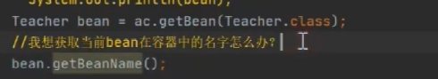
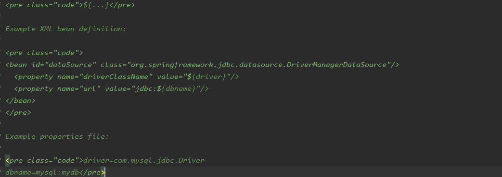

## 创造对象的方式

​	new | 反射 | 工厂

反射 

​	


## 加载/解析 xml/注解/json

​	

得到bean 的定义信息

 

## 实例化 和初始化


## PostProcessor


## aware 接口 


​	存在的意义

​	方便通过spring中的bean来获取对应容器的相关属性值

​	

## AOP 

​	AOP   >  动态代理  >  代理对象

```java
public interface BeanPostProcessor {

   Object postProcessBeforeInitialization(Object bean, String beanName) throws BeansException;

   Object postProcessAfterInitialization(Object bean, String beanName) throws BeansException;

}
```

以 这两个方法 去 找BeanPostProcessor 的子类实现

postProcessBeforeInitialization

postProcessAfterInitialization

子类（实现类）

​	AbstractAutoProxyCreator  

```java
// 直接返回了bean
@Override
public Object postProcessBeforeInitialization(Object bean, String beanName) {
   return bean;
}

//
@Override
public Object postProcessAfterInitialization(Object bean, String beanName) throws BeansException {
   if (bean != null) {
      Object cacheKey = getCacheKey(bean.getClass(), beanName);
      if (!this.earlyProxyReferences.contains(cacheKey)) {
         return wrapIfNecessary(bean, beanName, cacheKey);
      }
   }
   return bean;
}
```

其中

```java
return wrapIfNecessary(bean, beanName, cacheKey);
```

```java
protected Object wrapIfNecessary(Object bean, String beanName, Object cacheKey) {
   if (beanName != null && this.targetSourcedBeans.contains(beanName)) {
      return bean;
   }
   if (Boolean.FALSE.equals(this.advisedBeans.get(cacheKey))) {
      return bean;
   }
   if (isInfrastructureClass(bean.getClass()) || shouldSkip(bean.getClass(), beanName)) {
      this.advisedBeans.put(cacheKey, Boolean.FALSE);
      return bean;
   }

   // Create proxy if we have advice. 
   Object[] specificInterceptors = getAdvicesAndAdvisorsForBean(bean.getClass(), beanName, null);
   if (specificInterceptors != DO_NOT_PROXY) {
      this.advisedBeans.put(cacheKey, Boolean.TRUE);
       
      //创建动态代理
      Object proxy = createProxy(
            bean.getClass(), beanName, specificInterceptors, new SingletonTargetSource(bean));
      this.proxyTypes.put(cacheKey, proxy.getClass());
      return proxy;
   }

   this.advisedBeans.put(cacheKey, Boolean.FALSE);
   return bean;
}
```

```java
Object proxy = createProxy(
      bean.getClass(), beanName, specificInterceptors, new SingletonTargetSource(bean));
```

​		

```java
protected Object createProxy(
      Class<?> beanClass, String beanName, Object[] specificInterceptors, TargetSource targetSource) {

   if (this.beanFactory instanceof ConfigurableListableBeanFactory) {
      AutoProxyUtils.exposeTargetClass((ConfigurableListableBeanFactory) this.beanFactory, beanName, beanClass);
   }

   ProxyFactory proxyFactory = new ProxyFactory();
   proxyFactory.copyFrom(this);

   if (!proxyFactory.isProxyTargetClass()) {
      if (shouldProxyTargetClass(beanClass, beanName)) {
         proxyFactory.setProxyTargetClass(true);
      }
      else {
         evaluateProxyInterfaces(beanClass, proxyFactory);
      }
   }

   Advisor[] advisors = buildAdvisors(beanName, specificInterceptors);
   proxyFactory.addAdvisors(advisors);
   proxyFactory.setTargetSource(targetSource);
   customizeProxyFactory(proxyFactory);

   proxyFactory.setFrozen(this.freezeProxy);
   if (advisorsPreFiltered()) {
      proxyFactory.setPreFiltered(true);
   }

   return proxyFactory.getProxy(getProxyClassLoader());
}
```

```java
return proxyFactory.getProxy(getProxyClassLoader());
```

​		点到底

```java
public interface AopProxy {

  
   Object getProxy();

  
   Object getProxy(ClassLoader classLoader);

}
```

​		interface AopProxy 的实现类	

​	

# 开始(※)

## BeanFactory （接口）

​	bean容器其中一个入口


### 	子类（实现类）

public class DefaultListableBeanFactory

​			帮助spring 创造bean对象


## BeanFactoryPostProcessor（bean工厂后置处理器）


作用是：

​	将$(jdbc.username)   这一类的数据解析出来 赋给property name


### 子类(实现类)

​	PlaceholderConfigurerSupport 

​	头注释




依次 可知

可在运行时 修改bean 的信息的

```java
public class AccountFactoryPostProcessor implements BeanFactoryPostProcessor {
    @Override
    public void postProcessBeanFactory(ConfigurableListableBeanFactory beanFactory) throws BeansException {
        BeanDefinition accountDao = beanFactory.getBeanDefinition("AccountDao");
        //accountDao 拿到这个bean 就可以修改属性信息了
    }
}
```

 		例：能在这里改一百个bean的信息

​		 例： @ComponentScan （"包"） 解析包下的类

​		至此 完成了实例化前期工作 开始实例化 


## Bean的生命周期


```java
					BeanFactory 注释 
<li>BeanNameAware's {@code setBeanName}
* <li>BeanClassLoaderAware's {@code setBeanClassLoader}
* <li>BeanFactoryAware's {@code setBeanFactory}
* <li>EnvironmentAware's {@code setEnvironment}
* <li>EmbeddedValueResolverAware's {@code setEmbeddedValueResolver}
* <li>ResourceLoaderAware's {@code setResourceLoader}
* (only applicable when running in an application context)
* <li>ApplicationEventPublisherAware's {@code setApplicationEventPublisher}
* (only applicable when running in an application context)
* <li>MessageSourceAware's {@code setMessageSource}
* (only applicable when running in an application context)
* <li>ApplicationContextAware's {@code setApplicationContext}
* (only applicable when running in an application context)
* <li>ServletContextAware's {@code setServletContext}
* (only applicable when running in a web application context)
	
//  						步骤
// <li>{@code postProcessBeforeInitialization} methods of BeanPostProcessors 
// <li>InitializingBean's {@code afterPropertiesSet}
//<li>a custom init-method definition
//<li>{@code postProcessAfterInitialization} methods of BeanPostProcessors

```

# Spring 源码开始 :baby_chick:

