# 循环依赖开始:baby_chick:

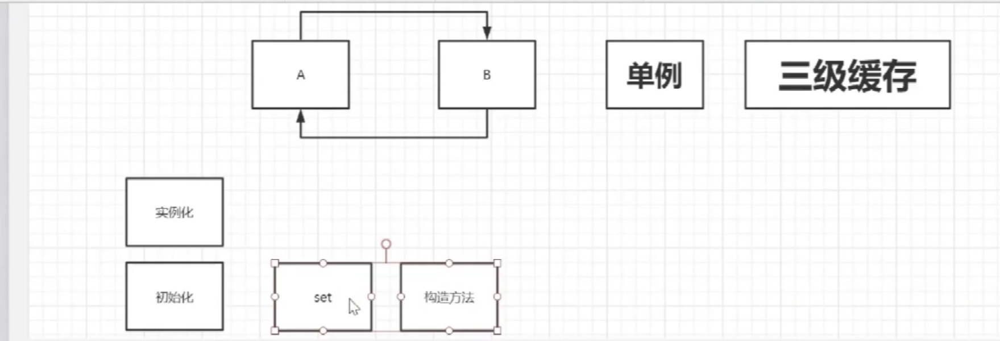

set ： 可以解决循环哟了问题

构造方法： 不能

原因： set 是 先创建对象 再幅值

​			 构造方法 是  合在一起进行。

> ### 实例化和初始化分开处理

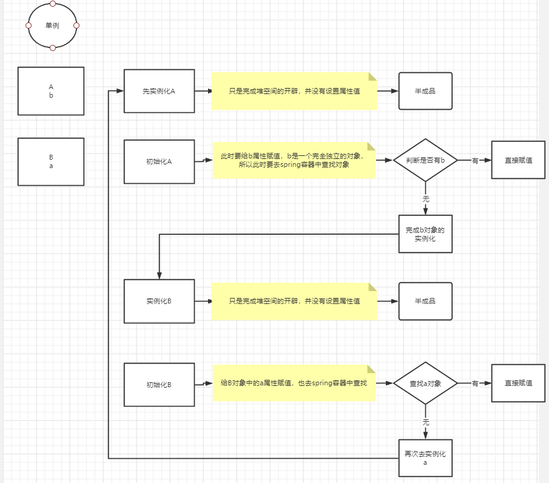

解决方法：

​	将A的半成品放进容器里 直接找半成品

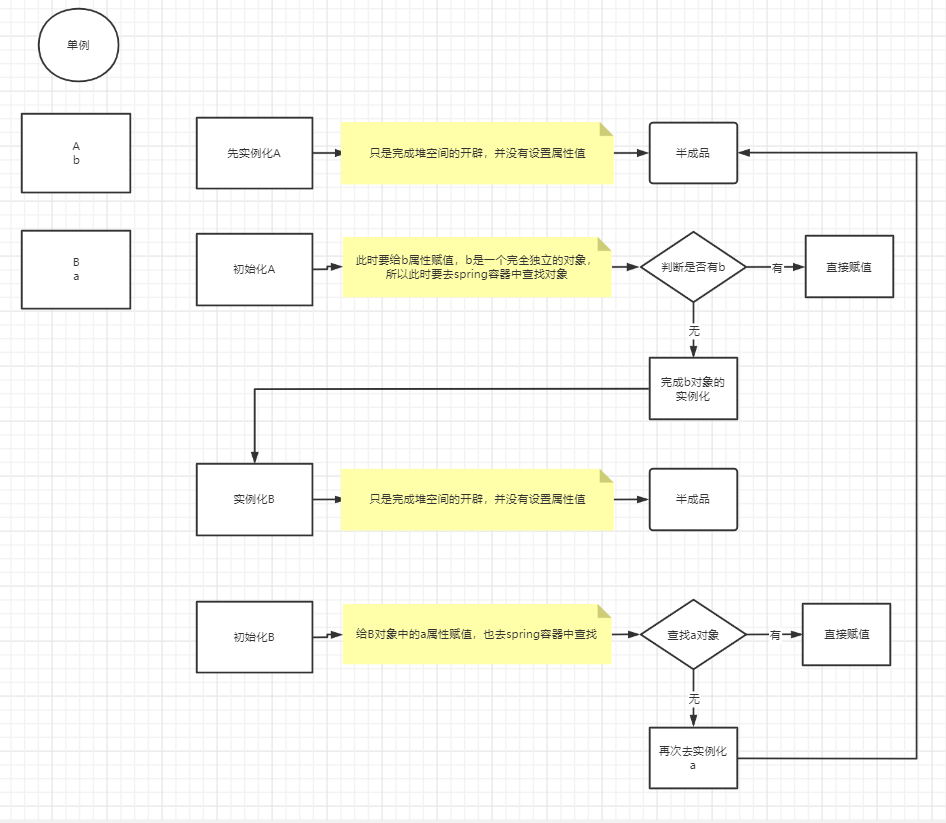

## DefaultSingletonBeanRegistry (※)

```java
public class DefaultSingletonBeanRegistry extends SimpleAliasRegistry implements SingletonBeanRegistry {

   /** Maximum number of suppressed exceptions to preserve. */
   private static final int SUPPRESSED_EXCEPTIONS_LIMIT = 100;


   /** Cache of singleton objects: bean name to bean instance. */
   //一级缓存
   //用于保存BeanName和创建bean实例之间的关系
   private final Map<String, Object> singletonObjects = new ConcurrentHashMap<>(256);

   /** Cache of singleton factories: bean name to ObjectFactory. */
   //三级缓存
   //用于保存BeanName和创建工厂之间的关系
   private final Map<String, ObjectFactory<?>> singletonFactories = new HashMap<>(16);

   /** Cache of early singleton objects: bean name to bean instance. */
   //二级缓存
   //保存BeanName和创建bean之间的关系 不同于一级缓存的是，当一个单例bean被放到这里后，那么当bean还在就可以通过getBean方法获得，可以方便进行循环依赖的检测
   private final Map<String, Object> earlySingletonObjects = new ConcurrentHashMap<>(16);

   /** Set of registered singletons, containing the bean names in registration order. */
   private final Set<String> registeredSingletons = new LinkedHashSet<>(256);

   /** Names of beans that are currently in creation. */
   private final Set<String> singletonsCurrentlyInCreation =
         Collections.newSetFromMap(new ConcurrentHashMap<>(16));

   /** Names of beans currently excluded from in creation checks. */
   private final Set<String> inCreationCheckExclusions =
         Collections.newSetFromMap(new ConcurrentHashMap<>(16));
```

​		三个缓存的不同：泛型

​		三级缓存中的ObjectFactory<?>

### interface ObjectFactory<>

```java
@FunctionalInterface //函数式接口
public interface ObjectFactory<T> {

   /**
    * Return an instance (possibly shared or independent)
    * of the object managed by this factory.
    * @return the resulting instance
    * @throws BeansException in case of creation errors
    */
   T getObject() throws BeansException;

}
```

​		表示可以传 表达式

# Debug 开始

## ClassPathXmlApplicationContext

```java
public ClassPathXmlApplicationContext(
      String[] configLocations, boolean refresh, @Nullable ApplicationContext parent)
      throws BeansException {

   super(parent);
   setConfigLocations(configLocations); // 加载配置文件
   if (refresh) {
      refresh();
   }
}
```

## refresh()

​	

```java
@Override
public void refresh() throws BeansException, IllegalStateException {
   synchronized (this.startupShutdownMonitor) {
      // Prepare this context for refreshing. 做一些准备工作
      prepareRefresh(); 

      // Tell the subclass to refresh the internal bean factory. //创建ioc 容器并且加载bean
      ConfigurableListableBeanFactory beanFactory = obtainFreshBeanFactory();
		
      // Prepare the bean factory for use in this context.
      // 对BeanFactory的属性进行填充 （准备工作）
      prepareBeanFactory(beanFactory);

      try {
         // Allows post-processing of the bean factory in context subclasses.
         postProcessBeanFactory(beanFactory);

         // Invoke factory processors registered as beans in the context.
         invokeBeanFactoryPostProcessors(beanFactory);

         // Register bean processors that intercept bean creation.
         registerBeanPostProcessors(beanFactory);

         // Initialize message source for this context.
         initMessageSource();

         // Initialize event multicaster for this context.
         initApplicationEventMulticaster();

         // Initialize other special beans in specific context subclasses.
         onRefresh();

         // Check for listener beans and register them.
         registerListeners();

         // Instantiate all remaining (non-lazy-init) singletons.
         finishBeanFactoryInitialization(beanFactory);

         // Last step: publish corresponding event.
         finishRefresh();
      }
```

### 		finishBeanFactoryInitialization(beanFactory);

```java
protected void finishBeanFactoryInitialization(ConfigurableListableBeanFactory beanFactory) {
   // Initialize conversion service for this context.
   if (beanFactory.containsBean(CONVERSION_SERVICE_BEAN_NAME) &&
         beanFactory.isTypeMatch(CONVERSION_SERVICE_BEAN_NAME, ConversionService.class)) {
      beanFactory.setConversionService(
            beanFactory.getBean(CONVERSION_SERVICE_BEAN_NAME, ConversionService.class));
   }

   // Register a default embedded value resolver if no bean post-processor
   // (such as a PropertyPlaceholderConfigurer bean) registered any before:
   // at this point, primarily for resolution in annotation attribute values.
   if (!beanFactory.hasEmbeddedValueResolver()) {
      beanFactory.addEmbeddedValueResolver(strVal -> getEnvironment().resolvePlaceholders(strVal));
   }

   // Initialize LoadTimeWeaverAware beans early to allow for registering their transformers early.
   String[] weaverAwareNames = beanFactory.getBeanNamesForType(LoadTimeWeaverAware.class, false, false);
   for (String weaverAwareName : weaverAwareNames) {
      getBean(weaverAwareName);
   }

   // Stop using the temporary ClassLoader for type matching.
   beanFactory.setTempClassLoader(null);

   // Allow for caching all bean definition metadata, not expecting further changes.
   beanFactory.freezeConfiguration();

   // Instantiate all remaining (non-lazy-init) singletons.
   // 实例化剩下的单例对象（非懒加载的）
   beanFactory.preInstantiateSingletons();
}
```

#### 	preInstantiateSingletons(); 

```java
public void preInstantiateSingletons() throws BeansException {
   if (logger.isTraceEnabled()) {
      logger.trace("Pre-instantiating singletons in " + this);
   }

	//此时有两个:   A ,  B 
   List<String> beanNames = new ArrayList<>(this.beanDefinitionNames);
	
   // Trigger initialization of all non-lazy singleton beans...
   // 循环创建 首先是a 
   for (String beanName : beanNames) {
      // 获取名字
      RootBeanDefinition bd = getMergedLocalBeanDefinition(beanName);
       //判断是否是抽象的，单例的，懒加载的； 结果： !false && true && !false  = true
      if (!bd.isAbstract() && bd.isSingleton() && !bd.isLazyInit()) {
          //判断是否实现FactoryBean的接口 没有实现任何Aware 接口 所以为 false 所以直接
         if (isFactoryBean(beanName)) {
           //...进不来 就不展示了
         }
         else { 
            //来到此处
            //spring 每次在创建对象时都是先从容器中查找，找不到再创建
            getBean(beanName);
         }
      }
   }

   // Trigger post-initialization callback for all applicable beans...
   for (String beanName : beanNames) {
      Object singletonInstance = getSingleton(beanName);
      if (singletonInstance instanceof SmartInitializingSingleton) {
         SmartInitializingSingleton smartSingleton = (SmartInitializingSingleton) singletonInstance;
         if (System.getSecurityManager() != null) {
            AccessController.doPrivileged((PrivilegedAction<Object>) () -> {
               smartSingleton.afterSingletonsInstantiated();
               return null;
            }, getAccessControlContext());
         }
         else {
            smartSingleton.afterSingletonsInstantiated();
         }
      }
   }
}
```

##### 	getBean(beanName)   ==> doGetBean() 

```java
protected <T> T doGetBean(
      String name, @Nullable Class<T> requiredType, @Nullable Object[] args, boolean typeCheckOnly)
      throws BeansException {
	//名字的转换 A
   String beanName = transformedBeanName(name);
   Object bean;
   // Eagerly check singleton cache for manually registered singletons.
   //查找
   Object sharedInstance = getSingleton(beanName); // A
   if (sharedInstance != null && args == null) {
      if (logger.isTraceEnabled()) {
         if (isSingletonCurrentlyInCreation(beanName)) {
            logger.trace("Returning eagerly cached instance of singleton bean '" + beanName +
                  "' that is not fully initialized yet - a consequence of a circular reference");
         }
         else {
            logger.trace("Returning cached instance of singleton bean '" + beanName + "'");
         }
      }
      bean = getObjectForBeanInstance(sharedInstance, name, beanName, null);
   }
	
   //省略一波...
    
   return (T) bean;
}
```

###### getSingleton(beanName);

```java
protected Object getSingleton(String beanName, boolean allowEarlyReference) {
    
   //singletonObjects（一级缓存）
   // this.singletonObjects.get(beanName); 在一级缓存里查找
   Object singletonObject = this.singletonObjects.get(beanName);
    
   //singletonObject == null == true && isSingletonCurrentlyInCreation(beanName){是否正在被创建（a还未被创建）false}; 整体结果： fasle
   if (singletonObject == null && isSingletonCurrentlyInCreation(beanName)) {
    //进不来......不展示
   }
    
  	//返回null
   return singletonObject;
}
```

> ​		由此可见 spring 每次在创建对象时都是先从一级缓存中查找，

##### 	doGetBean(beanName)

```java
protected <T> T doGetBean(
      String name, @Nullable Class<T> requiredType, @Nullable Object[] args, boolean typeCheckOnly)
      throws BeansException {
   //转换名字	 
   String beanName = transformedBeanName(name);
   Object bean;
	
   // Eagerly check singleton cache for manually registered singletons.
   //singletonObjects（一级缓存）
   // this.singletonObjects.get(beanName); 查找（一级缓存）
   Object sharedInstance = getSingleton(beanName); // null
//sharedInstance == null 判断进不去
if (sharedInstance != null && args == null) {
			//...进不去 不展示
		}
    //既然找不到 那就去创建
    //....省略一波
    
				// Create bean instance.
				if (mbd.isSingleton()) {
                    //与上面是一样的getSingleton方法 只不过是传了一个表达式
					sharedInstance = getSingleton(beanName, () -> {
						try {
                            //实际上调的是createBean()
							return createBean(beanName, mbd, args);
						}
						catch (BeansException ex) {
							destroySingleton(beanName);
							throw ex;
						}
					});	
					bean = getObjectForBeanInstance(sharedInstance, name, beanName, mbd);
				}
}
```

​		因为 传进去的是一个lambda表达式 所以调用的是createBean

> 接口ObjectFactory 是一个函数式接口 仅有一个方法，可以传入lambda表达式，可以说匿名内部类，通过调用getObject方法来执行具体大的逻辑

###### 

###### 		getSingleton（beanname,() -> {....}）

​			

```java
public Object getSingleton(String beanName, ObjectFactory<?> singletonFactory) {
   Assert.notNull(beanName, "Bean name must not be null");
   synchronized (this.singletonObjects) {
      //singletonObjects(一级缓存) 取不到 等于null
      Object singletonObject = this.singletonObjects.get(beanName);
      if (singletonObject == null) {
         if (this.singletonsCurrentlyInDestruction) {
       		// 进不去 不展示...
         try {
            //singletonFactory 是传进来的参数;getObject是里面的方法
            singletonObject = singletonFactory.getObject();
            newSingleton = true;
         }
         catch (IllegalStateException ex) {
            // Has the singleton object implicitly appeared in the meantime ->
            // if yes, proceed with it since the exception indicates that state.
            singletonObject = this.singletonObjects.get(beanName);
            if (singletonObject == null) {
               throw ex;
            }
         }
         catch (BeanCreationException ex) {
            if (recordSuppressedExceptions) {
               for (Exception suppressedException : this.suppressedExceptions) {
                  ex.addRelatedCause(suppressedException);
               }
            }
            throw ex;
         }
         finally {
            if (recordSuppressedExceptions) {
               this.suppressedExceptions = null;
            }
            afterSingletonCreation(beanName);
         }
         if (newSingleton) {
            addSingleton(beanName, singletonObject);
         }
      }
      return singletonObject;
   }
}
```

###### 7.singletonFactory.getObject() == createBean()

​	

```java
@Override
protected Object createBean(String beanName, RootBeanDefinition mbd, @Nullable Object[] args)
      throws BeanCreationException {

   //...省略

   try {
       //到此 进入doCreateBean
      Object beanInstance = doCreateBean(beanName, mbdToUse, args);
      if (logger.isTraceEnabled()) {
         logger.trace("Finished creating instance of bean '" + beanName + "'");
      }
      return beanInstance;
   }
   catch (BeanCreationException | ImplicitlyAppearedSingletonException ex) {
      // A previously detected exception with proper bean creation context already,
      // or illegal singleton state to be communicated up to DefaultSingletonBeanRegistry.
      throw ex;
   }
   catch (Throwable ex) {
      throw new BeanCreationException(
            mbdToUse.getResourceDescription(), beanName, "Unexpected exception during bean creation", ex);
   }
}
```

###### 8.doCreateBean(beanName, mbdToUse, args);

```java
protected Object doCreateBean(String beanName, RootBeanDefinition mbd, @Nullable Object[] args)
			throws BeanCreationException {

		// Instantiate the bean.
		BeanWrapper instanceWrapper = null;
		if (mbd.isSingleton()) {
			instanceWrapper = this.factoryBeanInstanceCache.remove(beanName);
		}
		if (instanceWrapper == null) {
            //createBeanInstance(beanName, mbd, args) 完成了实例化
			instanceWrapper = createBeanInstance(beanName, mbd, args);
		}
		Object bean = instanceWrapper.getWrappedInstance();
		Class<?> beanType = instanceWrapper.getWrappedClass();
		if (beanType != NullBean.class) {
			mbd.resolvedTargetType = beanType;
		}
```

###### 9.createBeanInstance(beanName, mbd, args);

​	此代码就不演示了 请异步到Spring 源码流程

###### 8.doCreateBean(beanName, mbdToUse, args);

```java
protected Object doCreateBean(String beanName, RootBeanDefinition mbd, @Nullable Object[] args)
      throws BeanCreationException {

   // Instantiate the bean.
   BeanWrapper instanceWrapper = null;
   if (mbd.isSingleton()) {
      instanceWrapper = this.factoryBeanInstanceCache.remove(beanName);
   }
   if (instanceWrapper == null) {
      //完成createBeanInstance(beanName, mbd, args)；实例化
      instanceWrapper = createBeanInstance(beanName, mbd, args);
   }
    //A@2104 拿到A对象
   Object bean = instanceWrapper.getWrappedInstance(); 
   Class<?> beanType = instanceWrapper.getWrappedClass();
   if (beanType != NullBean.class) {
      mbd.resolvedTargetType = beanType;
   }
		
    	//....
    
		// Eagerly cache singletons to be able to resolve circular references
		// even when triggered by lifecycle interfaces like BeanFactoryAware.
		boolean earlySingletonExposure = (mbd.isSingleton() && this.allowCircularReferences &&
				isSingletonCurrentlyInCreation(beanName));
		if (earlySingletonExposure) {
			if (logger.isTraceEnabled()) {
				logger.trace("Eagerly caching bean '" + beanName +
						"' to allow for resolving potential circular references");
			}
            //将lombda 表达式添加进三级缓存 A
			addSingletonFactory(beanName, () -> getEarlyBeanReference(beanName, mbd, bean));
		}

```


###### 9.addSingletonFactory(beanName, () -> getEarlyBeanReference(beanName, mbd, bean));

```java
protected void addSingletonFactory(String beanName, ObjectFactory<?> singletonFactory) {
    
   Assert.notNull(singletonFactory, "Singleton factory must not be null");
   
   synchronized (this.singletonObjects) {
      //判断一级缓存里 包含不包含A 因为还没放进一级缓存呢 所以不包含 ;结果为true
      if (!this.singletonObjects.containsKey(beanName)) {
         //将其放入三级缓存 key，Value 形式 （beanName（A）,singletonFactory(形参：lombda表达式)）
         this.singletonFactories.put(beanName, singletonFactory);
         //二级缓存remove掉，此时是空 
         this.earlySingletonObjects.remove(beanName);
         //记录哪些bean对象已经注册过了
         this.registeredSingletons.add(beanName);
      }
   }
}
```

###### 8.doCreateBean(beanName, mbdToUse, args);

```java
protected Object doCreateBean(String beanName, RootBeanDefinition mbd, @Nullable Object[] args)
      throws BeanCreationException {

   // Instantiate the bean.
   BeanWrapper instanceWrapper = null;
   if (mbd.isSingleton()) {
      instanceWrapper = this.factoryBeanInstanceCache.remove(beanName);
   }
   if (instanceWrapper == null) {
      //完成createBeanInstance(beanName, mbd, args)；实例化
      instanceWrapper = createBeanInstance(beanName, mbd, args);
   }
    //A@2104 拿到A对象
   Object bean = instanceWrapper.getWrappedInstance(); 
   Class<?> beanType = instanceWrapper.getWrappedClass();
   if (beanType != NullBean.class) {
      mbd.resolvedTargetType = beanType;
   }
		
    	//....省略
    
		// Eagerly cache singletons to be able to resolve circular references
		// even when triggered by lifecycle interfaces like BeanFactoryAware.
		boolean earlySingletonExposure = (mbd.isSingleton() && this.allowCircularReferences &&
				isSingletonCurrentlyInCreation(beanName));
		if (earlySingletonExposure) {
			if (logger.isTraceEnabled()) {
				logger.trace("Eagerly caching bean '" + beanName +
						"' to allow for resolving potential circular references");
			//将lombda 表达式添加进三级缓存
			addSingletonFactory(beanName, () -> getEarlyBeanReference(beanName, mbd, bean));
		}


   // Initialize the bean instance.
   Object exposedObject = bean;
   try {
      //填充属性 （b）
      populateBean(beanName, mbd, instanceWrapper);
      exposedObject = initializeBean(beanName, exposedObject, mbd);
   }
   catch (Throwable ex) {
      if (ex instanceof BeanCreationException && beanName.equals(((BeanCreationException) ex).getBeanName())) {
         throw (BeanCreationException) ex;
      }
      else {
         throw new BeanCreationException(
               mbd.getResourceDescription(), beanName, "Initialization of bean failed", ex);
      }
   }
```

###### 9.populateBean(beanName, mbd, instanceWrapper);

```java
protected void populateBean(String beanName, RootBeanDefinition mbd, @Nullable BeanWrapper bw) {
   //...省略一大推判断

   if (pvs != null) {
      //开始填充属性值
      applyPropertyValues(beanName, mbd, bw, pvs);
   }
}
```

######  10.applyPropertyValues(beanName, mbd, bw, pvs);

```java
protected void applyPropertyValues(String beanName, BeanDefinition mbd, BeanWrapper bw, PropertyValues pvs) {

    //给A对象填充属性值

 	//省去一堆属性判断....

   // Create a deep copy, resolving any references for values.
   List<PropertyValue> deepCopy = new ArrayList<>(original.size());
    
   boolean resolveNecessary = false;
   for (PropertyValue pv : original) {
      if (pv.isConverted()) {
         deepCopy.add(pv);
      }
      else {
         //获取属性值 ；b
         String propertyName = pv.getName(); // b
         Object originalValue = pv.getValue(); // originalValue 是RuntimeBeanreference（运行时的bean引用）
         if (originalValue == AutowiredPropertyMarker.INSTANCE) {
            Method writeMethod = bw.getPropertyDescriptor(propertyName).getWriteMethod();
            if (writeMethod == null) {
               throw new IllegalArgumentException("Autowire marker for property without write method: " + pv);
            }
            originalValue = new DependencyDescriptor(new MethodParameter(writeMethod, 0), true);
         }
         //要对当前值 进行预处理工作
         Object resolvedValue = valueResolver.resolveValueIfNecessary(pv, originalValue);
         Object convertedValue = resolvedValue;
         boolean convertible = bw.isWritableProperty(propertyName) &&
               !PropertyAccessorUtils.isNestedOrIndexedProperty(propertyName);
         if (convertible) {
            convertedValue = convertForProperty(resolvedValue, propertyName, bw, converter);
         }
         // Possibly store converted value in merged bean definition,
         // in order to avoid re-conversion for every created bean instance.
         if (resolvedValue == originalValue) {
            if (convertible) {
               pv.setConvertedValue(convertedValue);
            }
            deepCopy.add(pv);
         }
         else if (convertible && originalValue instanceof TypedStringValue &&
               !((TypedStringValue) originalValue).isDynamic() &&
               !(convertedValue instanceof Collection || ObjectUtils.isArray(convertedValue))) {
            pv.setConvertedValue(convertedValue);
            deepCopy.add(pv);
         }
         else {
            resolveNecessary = true;
            deepCopy.add(new PropertyValue(pv, convertedValue));
         }
      }
   }
   if (mpvs != null && !resolveNecessary) {
      mpvs.setConverted();
   }

   // Set our (possibly massaged) deep copy.
   try {
      bw.setPropertyValues(new MutablePropertyValues(deepCopy));
   }
   catch (BeansException ex) {
      throw new BeanCreationException(
            mbd.getResourceDescription(), beanName, "Error setting property values", ex);
   }
}
```

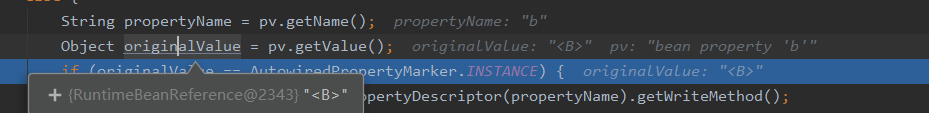

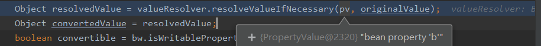

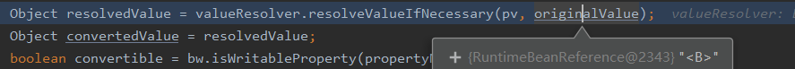

###### 11.valueResolver.resolveValueIfNecessary(pv, originalValue);

```java
@Nullable
public Object resolveValueIfNecessary(Object argName, @Nullable Object value) {
   // We must check each value to see whether it requires a runtime reference
   // to another bean to be resolved.
   //value 等于originalValue 肯定是RuntimeBeanReference 结果：true
   if (value instanceof RuntimeBeanReference) {
      //转型一波
      RuntimeBeanReference ref = (RuntimeBeanReference) value;
      //处理开始
      return resolveReference(argName, ref);
   }
   else if (value instanceof RuntimeBeanNameReference) {
      String refName = ((RuntimeBeanNameReference) value).getBeanName();
      refName = String.valueOf(doEvaluate(refName));
      if (!this.beanFactory.containsBean(refName)) {
         throw new BeanDefinitionStoreException(
               "Invalid bean name '" + refName + "' in bean reference for " + argName);
      }
      return refName;
   }
```

###### 12.resolveReference(argName, ref);

```java
private Object resolveReference(Object argName, RuntimeBeanReference ref) {
   try {
      Object bean;
      //获取Type
      Class<?> beanType = ref.getBeanType(); // null
      if (ref.isToParent()) {
         //没进判断...不展示
      }
      else {
         String resolvedName;
         if (beanType != null) {
         //没进判断...不展示
         }
         else {
            resolvedName = String.valueOf(doEvaluate(ref.getBeanName()));
            //填充b时 先会去spring容器里寻找b 找到直接赋值，没找到。。。
            bean = this.beanFactory.getBean(resolvedName);
         }
         this.beanFactory.registerDependentBean(resolvedName, this.beanName);
      }
      if (bean instanceof NullBean) {
         bean = null;
      }
      return bean;
   }
   catch (BeansException ex) {
      throw new BeanCreationException(
            this.beanDefinition.getResourceDescription(), this.beanName,
            "Cannot resolve reference to bean '" + ref.getBeanName() + "' while setting " + argName, ex);
   }
}
```

##### 		getBean(resolvedName); ==>doGetBean()

```java
protected <T> T doGetBean(
      String name, @Nullable Class<T> requiredType, @Nullable Object[] args, boolean typeCheckOnly)
      throws BeansException {
	//名字的转换 B
   String beanName = transformedBeanName(name);
   Object bean;

   // Eagerly check singleton cache for manually registered singletons.
   Object sharedInstance = getSingleton(beanName); // B
   if (sharedInstance != null && args == null) {
      if (logger.isTraceEnabled()) {
         if (isSingletonCurrentlyInCreation(beanName)) {
            logger.trace("Returning eagerly cached instance of singleton bean '" + beanName +
                  "' that is not fully initialized yet - a consequence of a circular reference");
         }
         else {
            logger.trace("Returning cached instance of singleton bean '" + beanName + "'");
         }
      }
      bean = getObjectForBeanInstance(sharedInstance, name, beanName, null);
   }

   else {
      // Fail if we're already creating this bean instance:
      // We're assumably within a circular reference.
      if (isPrototypeCurrentlyInCreation(beanName)) {
         throw new BeanCurrentlyInCreationException(beanName);
      }

     //...太长了 省略
   return (T) bean;
}
```

###### getSingleton(beanName);

```java
protected Object getSingleton(String beanName（b）, boolean allowEarlyReference) {
   // Quick check for existing instance without full singleton lock
   //从一级缓存里取 ; null
   Object singletonObject = this.singletonObjects.get(beanName);
   //singletonObject==null 为true isSingletonCurrentlyInCreation(beanName(b)) false
   //进不去判断
   if (singletonObject == null && isSingletonCurrentlyInCreation(beanName)) {
    	//进不去判断 直接返回null
   }
   return singletonObject; // null
}
```

##### doGetBean(beanName)

​	

```java
protected <T> T doGetBean(
      String name, @Nullable Class<T> requiredType, @Nullable Object[] args, boolean typeCheckOnly)
      throws BeansException {
	//名字的转化 Bs
   String beanName = transformedBeanName(name);//B
   Object bean;
s
   // Eagerly check singleton cache for manually registered singletons.
   //查找
   Object sharedInstance = getSingleton(beanName); //null
    
   if (sharedInstance != null && args == null) {
      if (logger.isTraceEnabled()) {
         if (isSingletonCurrentlyInCreation(beanName)) {
            logger.trace("Returning eagerly cached instance of singleton bean '" + beanName +
                  "' that is not fully initialized yet - a consequence of a circular reference");
         }
         else {
            logger.trace("Returning cached instance of singleton bean '" + beanName + "'");
         }
      }
      bean = getObjectForBeanInstance(sharedInstance, name, beanName, null);
   }
    
}
```

​		

> ### 根据流程，到此 该实例化B对象了

​	

```java
protected <T> T doGetBean(
      String name, @Nullable Class<T> requiredType, @Nullable Object[] args, boolean typeCheckOnly)
      throws BeansException {
	//转换 名字 B
   String beanName = transformedBeanName(name);
   Object bean;
    
   // Eagerly check singleton cache for manually registered singletons.
   //查找 
   Object sharedInstance = getSingleton(beanName); // null
   if (sharedInstance != null && args == null) {
      // 进不去 不展示
         }
         else {
            logger.trace("Returning cached instance of singleton bean '" + beanName + "'");
         }
      }
      bean = getObjectForBeanInstance(sharedInstance, name, beanName, null);
   }

   
	
         // Create bean instance.
         if (mbd.isSingleton()) {
            //beanName为 B
            sharedInstance = getSingleton(beanName, () -> {
               try {
                  return createBean(beanName, mbd, args);
               }
               catch (BeansException ex) {
                  destroySingleton(beanName);
                  throw ex;
               }
            });
            bean = getObjectForBeanInstance(sharedInstance, name, beanName, mbd);
         }
```

###### 			getSingleton(beanName, {...})

​		

```java
public Object getSingleton(String beanName, ObjectFactory<?> singletonFactory) {
   Assert.notNull(beanName, "Bean name must not be null");
   synchronized (this.singletonObjects) {
      Object singletonObject = this.singletonObjects.get(beanName);
      if (singletonObject == null) {
         if (this.singletonsCurrentlyInDestruction) {
            throw new BeanCreationNotAllowedException(beanName,
                  "Singleton bean creation not allowed while singletons of this factory are in destruction " +
                  "(Do not request a bean from a BeanFactory in a destroy method implementation!)");
         }
         if (logger.isDebugEnabled()) {
            logger.debug("Creating shared instance of singleton bean '" + beanName + "'");
         }
         beforeSingletonCreation(beanName);
         boolean newSingleton = false;
         boolean recordSuppressedExceptions = (this.suppressedExceptions == null);
         if (recordSuppressedExceptions) {
            this.suppressedExceptions = new LinkedHashSet<>();
         }
         try {
            //调用的是getObject方法
            singletonObject = singletonFactory.getObject();
            newSingleton = true;
         }
         catch (IllegalStateException ex) {
            // Has the singleton object implicitly appeared in the meantime ->
            // if yes, proceed with it since the exception indicates that state.
            singletonObject = this.singletonObjects.get(beanName);
            if (singletonObject == null) {
               throw ex;
            }
         }
       
        	//....
          
      return singletonObject;
   }
}
```

###### 7.singletonFactory.getObject() == createBean

```java
protected Object createBean(String beanName, RootBeanDefinition mbd, @Nullable Object[] args)
      throws BeanCreationException {

   if (logger.isTraceEnabled()) {
      logger.trace("Creating instance of bean '" + beanName + "'");
   }
   RootBeanDefinition mbdToUse = mbd;

   // Make sure bean class is actually resolved at this point, and
   // clone the bean definition in case of a dynamically resolved Class
   // which cannot be stored in the shared merged bean definition.
   Class<?> resolvedClass = resolveBeanClass(mbd, beanName);
   if (resolvedClass != null && !mbd.hasBeanClass() && mbd.getBeanClassName() != null) {
      mbdToUse = new RootBeanDefinition(mbd);
      mbdToUse.setBeanClass(resolvedClass);
   }

   // Prepare method overrides.
   try {
      mbdToUse.prepareMethodOverrides();
   }
   catch (BeanDefinitionValidationException ex) {
      throw new BeanDefinitionStoreException(mbdToUse.getResourceDescription(),
            beanName, "Validation of method overrides failed", ex);
   }

   try {
      // Give BeanPostProcessors a chance to return a proxy instead of the target bean instance.
      Object bean = resolveBeforeInstantiation(beanName, mbdToUse);
      if (bean != null) {
         return bean;
      }
   }
   catch (Throwable ex) {
      throw new BeanCreationException(mbdToUse.getResourceDescription(), beanName,
            "BeanPostProcessor before instantiation of bean failed", ex);
   }

   try {
      //执行doCreateBean
      Object beanInstance = doCreateBean(beanName, mbdToUse, args);
      if (logger.isTraceEnabled()) {
         logger.trace("Finished creating instance of bean '" + beanName + "'");
      }
      return beanInstance;
   }
   //.....
}
```

###### 8.doCreateBean(beanName, mbdToUse, args);

```java
protected Object doCreateBean(String beanName, RootBeanDefinition mbd, @Nullable Object[] args)
      throws BeanCreationException {

   // Instantiate the bean.
   BeanWrapper instanceWrapper = null;
   if (mbd.isSingleton()) {
      instanceWrapper = this.factoryBeanInstanceCache.remove(beanName);
   }
   if (instanceWrapper == null) {
      //完成createBeanInstance(beanName, mbd, args)；实例化
      instanceWrapper = createBeanInstance(beanName, mbd, args);
   }
    
   Object bean = instanceWrapper.getWrappedInstance(); //B @2570
   Class<?> beanType = instanceWrapper.getWrappedClass();
   if (beanType != NullBean.class) {
      mbd.resolvedTargetType = beanType;
   }

   // Allow post-processors to modify the merged bean definition.
   synchronized (mbd.postProcessingLock) {
      if (!mbd.postProcessed) {
         try {
            applyMergedBeanDefinitionPostProcessors(mbd, beanType, beanName);
         }
         catch (Throwable ex) {
            throw new BeanCreationException(mbd.getResourceDescription(), beanName,
                  "Post-processing of merged bean definition failed", ex);
         }
         mbd.postProcessed = true;
      }
   }

   // Eagerly cache singletons to be able to resolve circular references
   // even when triggered by lifecycle interfaces like BeanFactoryAware.
   boolean earlySingletonExposure = (mbd.isSingleton() && this.allowCircularReferences &&
         isSingletonCurrentlyInCreation(beanName));
   if (earlySingletonExposure) {
      if (logger.isTraceEnabled()) {
         logger.trace("Eagerly caching bean '" + beanName +
               "' to allow for resolving potential circular references");
      }
      addSingletonFactory(beanName, () -> getEarlyBeanReference(beanName, mbd, bean));
   }
    //....
}
```

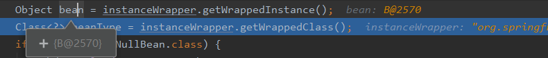

> ​		创建完半成品对象B 现在执行初始化

​		

```java
protected Object doCreateBean(String beanName, RootBeanDefinition mbd, @Nullable Object[] args)
      throws BeanCreationException {

   // Instantiate the bean.
   BeanWrapper instanceWrapper = null;
   if (mbd.isSingleton()) {
      instanceWrapper = this.factoryBeanInstanceCache.remove(beanName);
   }
   if (instanceWrapper == null) {
      //完成createBeanInstance(beanName, mbd, args)；实例化
      instanceWrapper = createBeanInstance(beanName, mbd, args);
   }
    
   Object bean = instanceWrapper.getWrappedInstance(); //B @2570
   Class<?> beanType = instanceWrapper.getWrappedClass();
   if (beanType != NullBean.class) {
      mbd.resolvedTargetType = beanType;
   }

   // Allow post-processors to modify the merged bean definition.
   synchronized (mbd.postProcessingLock) {
      if (!mbd.postProcessed) {
         try {
            applyMergedBeanDefinitionPostProcessors(mbd, beanType, beanName);
         }
         catch (Throwable ex) {
            throw new BeanCreationException(mbd.getResourceDescription(), beanName,
                  "Post-processing of merged bean definition failed", ex);
         }
         mbd.postProcessed = true;
      }
   }

   // Eagerly cache singletons to be able to resolve circular references
   // even when triggered by lifecycle interfaces like BeanFactoryAware.
   boolean earlySingletonExposure = (mbd.isSingleton() && this.allowCircularReferences &&
         isSingletonCurrentlyInCreation(beanName));
   if (earlySingletonExposure) {
      if (logger.isTraceEnabled()) {
         logger.trace("Eagerly caching bean '" + beanName +
               "' to allow for resolving potential circular references");
      }
      //将lombda 表达式添加进三级缓存 B
      addSingletonFactory(beanName, () -> getEarlyBeanReference(beanName, mbd, bean));
   }
    //....
}
```

###### 		省略一步addSingletonFactory（beanName,.......）		

###### 		8.doCreateBean(beanName,mbdToUse,args)

```java
protected Object doCreateBean(String beanName, RootBeanDefinition mbd, @Nullable Object[] args)
      throws BeanCreationException {

   // Instantiate the bean.
   BeanWrapper instanceWrapper = null;
   if (mbd.isSingleton()) {
      instanceWrapper = this.factoryBeanInstanceCache.remove(beanName);
   }
   if (instanceWrapper == null) {
      instanceWrapper = createBeanInstance(beanName, mbd, args);
   }
   Object bean = instanceWrapper.getWrappedInstance();
   Class<?> beanType = instanceWrapper.getWrappedClass();
   if (beanType != NullBean.class) {
      mbd.resolvedTargetType = beanType;
   }

   // Allow post-processors to modify the merged bean definition.
   synchronized (mbd.postProcessingLock) {
      if (!mbd.postProcessed) {
         try {
            applyMergedBeanDefinitionPostProcessors(mbd, beanType, beanName);
         }
         catch (Throwable ex) {
            throw new BeanCreationException(mbd.getResourceDescription(), beanName,
                  "Post-processing of merged bean definition failed", ex);
         }
         mbd.postProcessed = true;
      }
   }

   // Eagerly cache singletons to be able to resolve circular references
   // even when triggered by lifecycle interfaces like BeanFactoryAware.
   boolean earlySingletonExposure = (mbd.isSingleton() && this.allowCircularReferences &&
         isSingletonCurrentlyInCreation(beanName));
   if (earlySingletonExposure) {
      if (logger.isTraceEnabled()) {
         logger.trace("Eagerly caching bean '" + beanName +
               "' to allow for resolving potential circular references");
      }
      addSingletonFactory(beanName, () -> getEarlyBeanReference(beanName, mbd, bean));
   }

   // Initialize the bean instance.
   Object exposedObject = bean;
   try {
      //关键的一步 此时是给对象B初始化值
      populateBean(beanName, mbd, instanceWrapper);
      exposedObject = initializeBean(beanName, exposedObject, mbd);
   }
   catch (Throwable ex) {
      if (ex instanceof BeanCreationException && beanName.equals(((BeanCreationException) ex).getBeanName())) {
         throw (BeanCreationException) ex;
      }
      else {
         throw new BeanCreationException(
               mbd.getResourceDescription(), beanName, "Initialization of bean failed", ex);
      }
   }
}
```

###### 9.populateBean(beanName, mbd, instanceWrapper);

```java
protected void populateBean(String beanName, RootBeanDefinition mbd, @Nullable BeanWrapper bw) {
 	//....省略

   if (pvs != null) {
      applyPropertyValues(beanName, mbd, bw, pvs);
   }
}
```

###### 10.applyPropertyValues(beanName, mbd, bw, pvs);

```java
protected void applyPropertyValues(String beanName, BeanDefinition mbd, BeanWrapper bw, PropertyValues pvs) {
   if (pvs.isEmpty()) {
      return;
   }

   if (System.getSecurityManager() != null && bw instanceof BeanWrapperImpl) {
      ((BeanWrapperImpl) bw).setSecurityContext(getAccessControlContext());
   }

   MutablePropertyValues mpvs = null;
   List<PropertyValue> original;

   if (pvs instanceof MutablePropertyValues) {
      mpvs = (MutablePropertyValues) pvs;
      if (mpvs.isConverted()) {
         // Shortcut: use the pre-converted values as-is.
         try {
            bw.setPropertyValues(mpvs);
            return;
         }
         catch (BeansException ex) {
            throw new BeanCreationException(
                  mbd.getResourceDescription(), beanName, "Error setting property values", ex);
         }
      }
      original = mpvs.getPropertyValueList();
   }
   else {
      original = Arrays.asList(pvs.getPropertyValues());
   }

   TypeConverter converter = getCustomTypeConverter();
   if (converter == null) {
      converter = bw;
   }
   BeanDefinitionValueResolver valueResolver = new BeanDefinitionValueResolver(this, beanName, mbd, converter);

   // Create a deep copy, resolving any references for values.
   List<PropertyValue> deepCopy = new ArrayList<>(original.size());
   boolean resolveNecessary = false;
   for (PropertyValue pv : original) {
      if (pv.isConverted()) {
         deepCopy.add(pv);
      }
      else {
         //a
         String propertyName = pv.getName();
         Object originalValue = pv.getValue(); // RuntimeBeanReference A
         if (originalValue == AutowiredPropertyMarker.INSTANCE) {
            Method writeMethod = bw.getPropertyDescriptor(propertyName).getWriteMethod();
            if (writeMethod == null) {
               throw new IllegalArgumentException("Autowire marker for property without write method: " + pv);
            }
            originalValue = new DependencyDescriptor(new MethodParameter(writeMethod, 0), true);
         }
         Object resolvedValue = valueResolver.resolveValueIfNecessary(pv, originalValue);
         Object convertedValue = resolvedValue;
         boolean convertible = bw.isWritableProperty(propertyName) &&
               !PropertyAccessorUtils.isNestedOrIndexedProperty(propertyName);
         if (convertible) {
            convertedValue = convertForProperty(resolvedValue, propertyName, bw, converter);
         }
         // Possibly store converted value in merged bean definition,
         // in order to avoid re-conversion for every created bean instance.
         if (resolvedValue == originalValue) {
            if (convertible) {
               pv.setConvertedValue(convertedValue);
            }
            deepCopy.add(pv);
         }
         else if (convertible && originalValue instanceof TypedStringValue &&
               !((TypedStringValue) originalValue).isDynamic() &&
               !(convertedValue instanceof Collection || ObjectUtils.isArray(convertedValue))) {
            pv.setConvertedValue(convertedValue);
            deepCopy.add(pv);
         }
         else {
            resolveNecessary = true;
            deepCopy.add(new PropertyValue(pv, convertedValue));
         }
      }
   }
```


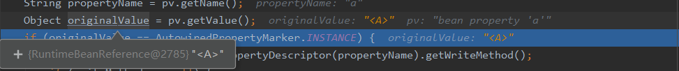

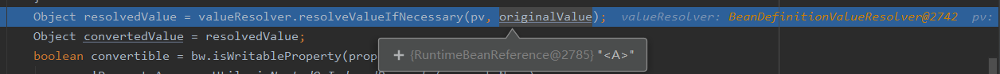

###### 11.valueResolver.resolveValueIfNecessary()

```java
public Object resolveValueIfNecessary(Object argName, @Nullable Object value) {
   // We must check each value to see whether it requires a runtime reference
   // to another bean to be resolved.
   if (value instanceof RuntimeBeanReference) {
      RuntimeBeanReference ref = (RuntimeBeanReference) value;
      //处理
      return resolveReference(argName, ref);
   }
   //.....省略
}
```

###### 	12.resolveReference(argName, ref);

```java
private Object resolveReference(Object argName, RuntimeBeanReference ref) {
   try {
      Object bean;
      Class<?> beanType = ref.getBeanType();
      if (ref.isToParent()) {
         BeanFactory parent = this.beanFactory.getParentBeanFactory();
         if (parent == null) {
            throw new BeanCreationException(
                  this.beanDefinition.getResourceDescription(), this.beanName,
                  "Cannot resolve reference to bean " + ref +
                        " in parent factory: no parent factory available");
         }
         if (beanType != null) {
            bean = parent.getBean(beanType);
         }
         else {
            bean = parent.getBean(String.valueOf(doEvaluate(ref.getBeanName())));
         }
      }
      else {
         String resolvedName;
         if (beanType != null) {
            NamedBeanHolder<?> namedBean = this.beanFactory.resolveNamedBean(beanType);
            bean = namedBean.getBeanInstance();
            resolvedName = namedBean.getBeanName();
         }
         else {
            resolvedName = String.valueOf(doEvaluate(ref.getBeanName()));
            //去容器里找 找不到再实例化 找到就赋值	
            bean = this.beanFactory.getBean(resolvedName);
         }
         this.beanFactory.registerDependentBean(resolvedName, this.beanName);
      }
      if (bean instanceof NullBean) {
         bean = null;
      }
      return bean;
   }
   catch (BeansException ex) {
      throw new BeanCreationException(
            this.beanDefinition.getResourceDescription(), this.beanName,
            "Cannot resolve reference to bean '" + ref.getBeanName() + "' while setting " + argName, ex);
   }
}
```

###### getBean ===》getSingleton（）

```java
@Nullable
protected Object getSingleton(String beanName, boolean allowEarlyReference) {
   // Quick check for existing instance without full singleton lock
   //一级缓存是肯定没的 所以：singletonObject == null ： true
   Object singletonObject = this.singletonObjects.get(beanName);
   // 因为A是半成品所以 肯定是 在创建中的 所以true 
   if (singletonObject == null && isSingletonCurrentlyInCreation(beanName)) {
      //进入判断
      //earlySingletonObjects 二级缓存
      //从二级缓存获取 ，也没 singletonObject == null；allowEarlyReference == true
      singletonObject = this.earlySingletonObjects.get(beanName);
      if (singletonObject == null && allowEarlyReference) {
         synchronized (this.singletonObjects) {
            // Consistent creation of early reference within full singleton lock
            singletonObject = this.singletonObjects.get(beanName);
            if (singletonObject == null) {
               singletonObject = this.earlySingletonObjects.get(beanName);
               if (singletonObject == null) {
                  ObjectFactory<?> singletonFactory = this.singletonFactories.get(beanName);
                  if (singletonFactory != null) {
                     //从三级缓存中找 此时的三级缓存有 a，b  lombda表达式
                     //所以我们可以获得 A的表达式
                     singletonObject = singletonFactory.getObject();
                     this.earlySingletonObjects.put(beanName, singletonObject);
                     this.singletonFactories.remove(beanName);
                  }
               }
            }
         }
      }
   }
   return singletonObject;
}
```


###### 7.singletonFactory.getObject(); ==getEarlyBeanReference(beanName, mbd, bean))

此时的getObject() == addSingletonFactory(beanName, () -> getEarlyBeanReference(beanName, mbd, bean))

```java
protected Object getEarlyBeanReference(String beanName, RootBeanDefinition mbd, Object bean) {
   Object exposedObject = bean; // A 
   //进不去判断
   if (!mbd.isSynthetic() && hasInstantiationAwareBeanPostProcessors()) {
      for (BeanPostProcessor bp : getBeanPostProcessors()) {
         if (bp instanceof SmartInstantiationAwareBeanPostProcessor) {
            SmartInstantiationAwareBeanPostProcessor ibp = (SmartInstantiationAwareBeanPostProcessor) bp;
            exposedObject = ibp.getEarlyBeanReference(exposedObject, beanName);
         }
      }
   }
   //直接返回 A
   return exposedObject;
}
```

###### 		getSingleton()

```JAVA
@Nullable
protected Object getSingleton(String beanName, boolean allowEarlyReference) {
   // Quick check for existing instance without full singleton lock
   //一级缓存是肯定没的 所以：singletonObject == null ： true
   Object singletonObject = this.singletonObjects.get(beanName);
   // 因为A是半成品所以 肯定是 在创建中的 所以true 
   if (singletonObject == null && isSingletonCurrentlyInCreation(beanName)) {
      //进入判断
      //earlySingletonObjects 二级缓存
      //从二级缓存获取 ，也没 singletonObject == null；allowEarlyReference == true
      singletonObject = this.earlySingletonObjects.get(beanName);
      if (singletonObject == null && allowEarlyReference) {
         synchronized (this.singletonObjects) {
            // Consistent creation of early reference within full singleton lock
            singletonObject = this.singletonObjects.get(beanName);
            if (singletonObject == null) {
               singletonObject = this.earlySingletonObjects.get(beanName);
               if (singletonObject == null) {
                  ObjectFactory<?> singletonFactory = this.singletonFactories.get(beanName);
                  if (singletonFactory != null) {
                     //从三级缓存中找 此时的三级缓存有 a，b  lombda表达式
                     //所以我们可以获得 A的表达式
                     singletonObject = singletonFactory.getObject();
                     //放入二级缓存
                     this.earlySingletonObjects.put(beanName, singletonObject);
                     //删掉三级缓存中的
                     this.singletonFactories.remove(beanName);
                  }
               }
            }
         }
      }
   }
   return singletonObject;
}
```

> 查找顺序 一级，二级，三级


###### 		8.applyPropertyValues（。。。）返回到此

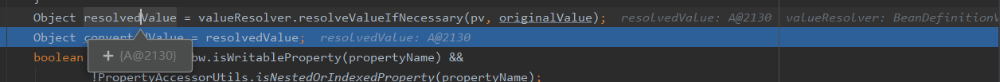

此时还是半成品

###### 返回到 doCreateBean

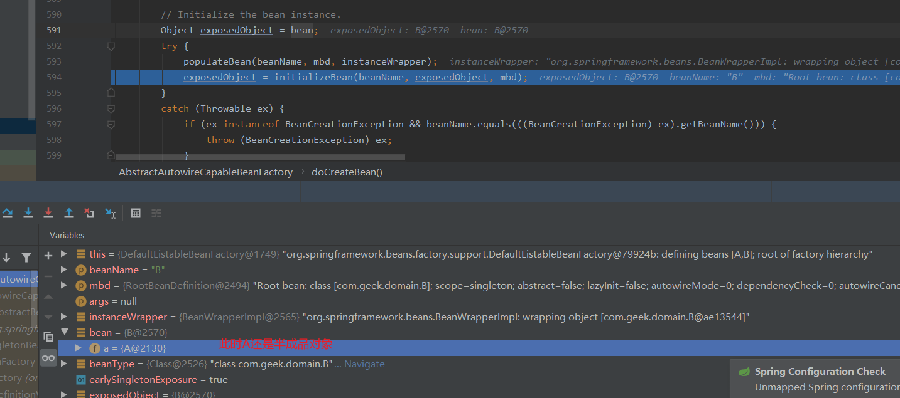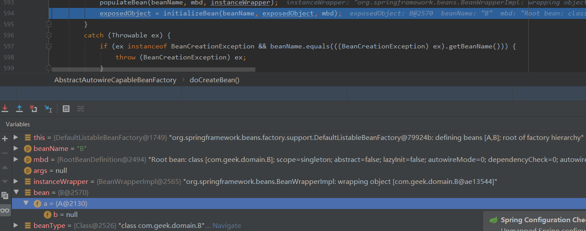

> 此时说明B的实例化初始化都完成了 现在该去完成A的初始化了   首先处理一些B的结束操作 放入一级缓存


###### getSingleton（）到此时 A为半成品 B为成品

```java
public Object getSingleton(String beanName, ObjectFactory<?> singletonFactory) {
   Assert.notNull(beanName, "Bean name must not be null");
   synchronized (this.singletonObjects) {
      Object singletonObject = this.singletonObjects.get(beanName);
      if (singletonObject == null) {
         if (this.singletonsCurrentlyInDestruction) {
            throw new BeanCreationNotAllowedException(beanName,
                  "Singleton bean creation not allowed while singletons of this factory are in destruction " +
                  "(Do not request a bean from a BeanFactory in a destroy method implementation!)");
         }
         if (logger.isDebugEnabled()) {
            logger.debug("Creating shared instance of singleton bean '" + beanName + "'");
         }
         beforeSingletonCreation(beanName);
         boolean newSingleton = false;
         boolean recordSuppressedExceptions = (this.suppressedExceptions == null);
         if (recordSuppressedExceptions) {
            this.suppressedExceptions = new LinkedHashSet<>();
         }
         try {
            singletonObject = singletonFactory.getObject();
            newSingleton = true;
         }
         catch (IllegalStateException ex) {
            // Has the singleton object implicitly appeared in the meantime ->
            // if yes, proceed with it since the exception indicates that state.
            // 出口
            singletonObject = this.singletonObjects.get(beanName);
            if (singletonObject == null) {
               throw ex;
            }
         }
         catch (BeanCreationException ex) {
            if (recordSuppressedExceptions) {
               for (Exception suppressedException : this.suppressedExceptions) {
                  ex.addRelatedCause(suppressedException);
               }
            }
            throw ex;
         }
         finally {
            if (recordSuppressedExceptions) {
               this.suppressedExceptions = null;
            }
            
            afterSingletonCreation(beanName);
         }
         if (newSingleton) {
            //到此时 A为半成品 B为成品
            addSingleton(beanName, singletonObject);
         }
      }
      return singletonObject;
   }
}
```

###### 7.addSingleton(beanName, singletonObject);

```java
protected void addSingleton(String beanName, Object singletonObject) {
   synchronized (this.singletonObjects) {
      //往一级缓存放 B
      this.singletonObjects.put(beanName, singletonObject);
      //删掉三级缓存中的B
      this.singletonFactories.remove(beanName);
      //删掉二级缓存中的B
      this.earlySingletonObjects.remove(beanName);
       
      this.registeredSingletons.add(beanName);
   }
}
```

###### 返回到第一次处理A的初始化的地方 applyPropertyValues

```java
protected void applyPropertyValues(String beanName, BeanDefinition mbd, BeanWrapper bw, PropertyValues pvs) {
   if (pvs.isEmpty()) {
      return;
   }

   if (System.getSecurityManager() != null && bw instanceof BeanWrapperImpl) {
      ((BeanWrapperImpl) bw).setSecurityContext(getAccessControlContext());
   }

   MutablePropertyValues mpvs = null;
   List<PropertyValue> original;

   if (pvs instanceof MutablePropertyValues) {
      mpvs = (MutablePropertyValues) pvs;
      if (mpvs.isConverted()) {
         // Shortcut: use the pre-converted values as-is.
         try {
            bw.setPropertyValues(mpvs);
            return;
         }
         catch (BeansException ex) {
            throw new BeanCreationException(
                  mbd.getResourceDescription(), beanName, "Error setting property values", ex);
         }
      }
      original = mpvs.getPropertyValueList();
   }
   else {
      original = Arrays.asList(pvs.getPropertyValues());
   }

   TypeConverter converter = getCustomTypeConverter();
   if (converter == null) {
      converter = bw;
   }
   BeanDefinitionValueResolver valueResolver = new BeanDefinitionValueResolver(this, beanName, mbd, converter);

   // Create a deep copy, resolving any references for values.
   List<PropertyValue> deepCopy = new ArrayList<>(original.size());
   boolean resolveNecessary = false;
   for (PropertyValue pv : original) {
      if (pv.isConverted()) {
         deepCopy.add(pv);
      }
      else {
         String propertyName = pv.getName();
         Object originalValue = pv.getValue();
         if (originalValue == AutowiredPropertyMarker.INSTANCE) {
            Method writeMethod = bw.getPropertyDescriptor(propertyName).getWriteMethod();
            if (writeMethod == null) {
               throw new IllegalArgumentException("Autowire marker for property without write method: " + pv);
            }
            originalValue = new DependencyDescriptor(new MethodParameter(writeMethod, 0), true);
         }
         //拿到B@2570
         Object resolvedValue = valueResolver.resolveValueIfNecessary(pv, originalValue);
         Object convertedValue = resolvedValue;
         boolean convertible = bw.isWritableProperty(propertyName) &&
               !PropertyAccessorUtils.isNestedOrIndexedProperty(propertyName);
         if (convertible) {
            convertedValue = convertForProperty(resolvedValue, propertyName, bw, converter);
         }
         // Possibly store converted value in merged bean definition,
         // in order to avoid re-conversion for every created bean instance.
         if (resolvedValue == originalValue) {
            if (convertible) {
               pv.setConvertedValue(convertedValue);
            }
            deepCopy.add(pv);
         }
         else if (convertible && originalValue instanceof TypedStringValue &&
               !((TypedStringValue) originalValue).isDynamic() &&
               !(convertedValue instanceof Collection || ObjectUtils.isArray(convertedValue))) {
            pv.setConvertedValue(convertedValue);
            deepCopy.add(pv);
         }
         else {
            resolveNecessary = true;
            deepCopy.add(new PropertyValue(pv, convertedValue));
         }
      }
   }
```

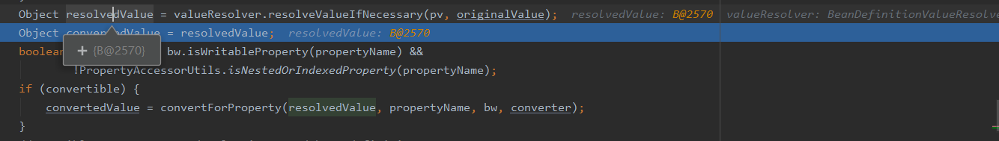

###### 返回到doCreateBean A

```java
protected Object doCreateBean(String beanName, RootBeanDefinition mbd, @Nullable Object[] args)
      throws BeanCreationException {

   // Instantiate the bean.
   BeanWrapper instanceWrapper = null;
   if (mbd.isSingleton()) {
      instanceWrapper = this.factoryBeanInstanceCache.remove(beanName);
   }
   if (instanceWrapper == null) {
      instanceWrapper = createBeanInstance(beanName, mbd, args);
   }
   Object bean = instanceWrapper.getWrappedInstance();
   Class<?> beanType = instanceWrapper.getWrappedClass();
   if (beanType != NullBean.class) {
      mbd.resolvedTargetType = beanType;
   }

   // Allow post-processors to modify the merged bean definition.
   synchronized (mbd.postProcessingLock) {
      if (!mbd.postProcessed) {
         try {
            applyMergedBeanDefinitionPostProcessors(mbd, beanType, beanName);
         }
         catch (Throwable ex) {
            throw new BeanCreationException(mbd.getResourceDescription(), beanName,
                  "Post-processing of merged bean definition failed", ex);
         }
         mbd.postProcessed = true;
      }
   }

   // Eagerly cache singletons to be able to resolve circular references
   // even when triggered by lifecycle interfaces like BeanFactoryAware.
   boolean earlySingletonExposure = (mbd.isSingleton() && this.allowCircularReferences &&
         isSingletonCurrentlyInCreation(beanName));
   if (earlySingletonExposure) {
      if (logger.isTraceEnabled()) {
         logger.trace("Eagerly caching bean '" + beanName +
               "' to allow for resolving potential circular references");
      }
      addSingletonFactory(beanName, () -> getEarlyBeanReference(beanName, mbd, bean));
   }

   // Initialize the bean instance.
   Object exposedObject = bean;
   try {
      populateBean(beanName, mbd, instanceWrapper);
      //此时已经是A成品对象了
      exposedObject = initializeBean(beanName, exposedObject, mbd);
   }
   catch (Throwable ex) {
      if (ex instanceof BeanCreationException && beanName.equals(((BeanCreationException) ex).getBeanName())) {
         throw (BeanCreationException) ex;
      }
      else {
         throw new BeanCreationException(
               mbd.getResourceDescription(), beanName, "Initialization of bean failed", ex);
      }
   }
```

###### 		getSingleton（）到此时 A为成品 B为成品

```java
public Object getSingleton(String beanName, ObjectFactory<?> singletonFactory) {
   Assert.notNull(beanName, "Bean name must not be null");
   synchronized (this.singletonObjects) {
      Object singletonObject = this.singletonObjects.get(beanName);
      if (singletonObject == null) {
         if (this.singletonsCurrentlyInDestruction) {
            throw new BeanCreationNotAllowedException(beanName,
                  "Singleton bean creation not allowed while singletons of this factory are in destruction " +
                  "(Do not request a bean from a BeanFactory in a destroy method implementation!)");
         }
         if (logger.isDebugEnabled()) {
            logger.debug("Creating shared instance of singleton bean '" + beanName + "'");
         }
         beforeSingletonCreation(beanName);
         boolean newSingleton = false;
         boolean recordSuppressedExceptions = (this.suppressedExceptions == null);
         if (recordSuppressedExceptions) {
            this.suppressedExceptions = new LinkedHashSet<>();
         }
         try {
            singletonObject = singletonFactory.getObject();
            newSingleton = true;
         }
         catch (IllegalStateException ex) {
            // Has the singleton object implicitly appeared in the meantime ->
            // if yes, proceed with it since the exception indicates that state.
            singletonObject = this.singletonObjects.get(beanName);
            if (singletonObject == null) {
               throw ex;
            }
         }
         catch (BeanCreationException ex) {
            if (recordSuppressedExceptions) {
               for (Exception suppressedException : this.suppressedExceptions) {
                  ex.addRelatedCause(suppressedException);
               }
            }
            throw ex;
         }
         finally {
            if (recordSuppressedExceptions) {
               this.suppressedExceptions = null;
            }
            afterSingletonCreation(beanName);
         }
         if (newSingleton) {
            //到此时 A为成品 B为成品
            addSingleton(beanName, singletonObject);
         }
      }
      return singletonObject;
   }
}
```

###### 7.addSingleton(beanName, singletonObject);

```java
protected void addSingleton(String beanName, Object singletonObject) {
   synchronized (this.singletonObjects) {
      //将A 放入一级缓存
      this.singletonObjects.put(beanName, singletonObject);
      //删除三级缓存 中的A
      this.singletonFactories.remove(beanName);
      //删除二级缓存 A
      this.earlySingletonObjects.remove(beanName);
      this.registeredSingletons.add(beanName);
   }
}
```

###### 返回到第一次getBean（"A"）preInstantiateSingletons()

```JAVA
public void preInstantiateSingletons() throws BeansException {
   if (logger.isTraceEnabled()) {
      logger.trace("Pre-instantiating singletons in " + this);
   }

   // Iterate over a copy to allow for init methods which in turn register new bean definitions.
   // While this may not be part of the regular factory bootstrap, it does otherwise work fine.
   List<String> beanNames = new ArrayList<>(this.beanDefinitionNames);

   // Trigger initialization of all non-lazy singleton beans...
   for (String beanName : beanNames) {
      RootBeanDefinition bd = getMergedLocalBeanDefinition(beanName);
      if (!bd.isAbstract() && bd.isSingleton() && !bd.isLazyInit()) {
         if (isFactoryBean(beanName)) {
            Object bean = getBean(FACTORY_BEAN_PREFIX + beanName);
            if (bean instanceof FactoryBean) {
               FactoryBean<?> factory = (FactoryBean<?>) bean;
               boolean isEagerInit;
               if (System.getSecurityManager() != null && factory instanceof SmartFactoryBean) {
                  isEagerInit = AccessController.doPrivileged(
                        (PrivilegedAction<Boolean>) ((SmartFactoryBean<?>) factory)::isEagerInit,
                        getAccessControlContext());
               }
               else {
                  isEagerInit = (factory instanceof SmartFactoryBean &&
                        ((SmartFactoryBean<?>) factory).isEagerInit());
               }
               if (isEagerInit) {
                  getBean(beanName);
               }
            }
         }
         else {
            getBean(beanName);
         }
      }
   }
```

接着下一次循环 beanNames里有A,B嘛 

进入循环

```java
public void preInstantiateSingletons() throws BeansException {
   if (logger.isTraceEnabled()) {
      logger.trace("Pre-instantiating singletons in " + this);
   }

   // Iterate over a copy to allow for init methods which in turn register new bean definitions.
   // While this may not be part of the regular factory bootstrap, it does otherwise work fine.
   List<String> beanNames = new ArrayList<>(this.beanDefinitionNames);

   // Trigger initialization of all non-lazy singleton beans...
   for (String beanName : beanNames) {
      RootBeanDefinition bd = getMergedLocalBeanDefinition(beanName);
      if (!bd.isAbstract() && bd.isSingleton() && !bd.isLazyInit()) {
         if (isFactoryBean(beanName)) {
            Object bean = getBean(FACTORY_BEAN_PREFIX + beanName);
            if (bean instanceof FactoryBean) {
               FactoryBean<?> factory = (FactoryBean<?>) bean;
               boolean isEagerInit;
               if (System.getSecurityManager() != null && factory instanceof SmartFactoryBean) {
                  isEagerInit = AccessController.doPrivileged(
                        (PrivilegedAction<Boolean>) ((SmartFactoryBean<?>) factory)::isEagerInit,
                        getAccessControlContext());
               }
               else {
                  isEagerInit = (factory instanceof SmartFactoryBean &&
                        ((SmartFactoryBean<?>) factory).isEagerInit());
               }
               if (isEagerInit) {
                  getBean(beanName);
               }
            }
         }
         else {
             //B
            getBean(beanName);
         }
      }
   }
```

来到 doGetBean

```java
protected <T> T doGetBean(
      String name, @Nullable Class<T> requiredType, @Nullable Object[] args, boolean typeCheckOnly)
      throws BeansException {

   String beanName = transformedBeanName(name);
   Object bean;

   // Eagerly check singleton cache for manually registered singletons.
   Object sharedInstance = getSingleton(beanName); //B
   if (sharedInstance != null && args == null) {
      if (logger.isTraceEnabled()) {
         if (isSingletonCurrentlyInCreation(beanName)) {
            logger.trace("Returning eagerly cached instance of singleton bean '" + beanName +
                  "' that is not fully initialized yet - a consequence of a circular reference");
         }
         else {
            logger.trace("Returning cached instance of singleton bean '" + beanName + "'");
         }
      }
      bean = getObjectForBeanInstance(sharedInstance, name, beanName, null);
   }
```

> 进入一级缓存查找B

```java
protected Object getSingleton(String beanName, boolean allowEarlyReference) {
   // Quick check for existing instance without full singleton lock
   Object singletonObject = this.singletonObjects.get(beanName); // 此时一定是有B的
   if (singletonObject == null && isSingletonCurrentlyInCreation(beanName)) {
      singletonObject = this.earlySingletonObjects.get(beanName);
      if (singletonObject == null && allowEarlyReference) {
         synchronized (this.singletonObjects) {
            // Consistent creation of early reference within full singleton lock
            singletonObject = this.singletonObjects.get(beanName);
            if (singletonObject == null) {
               singletonObject = this.earlySingletonObjects.get(beanName);
               if (singletonObject == null) {
                  ObjectFactory<?> singletonFactory = this.singletonFactories.get(beanName);
                  if (singletonFactory != null) {
                     singletonObject = singletonFactory.getObject();
                     this.earlySingletonObjects.put(beanName, singletonObject);
                     this.singletonFactories.remove(beanName);
                  }
               }
            }
         }
      }
   }
    //返回B
   return singletonObject;
}
```

> ### 到此 结束了