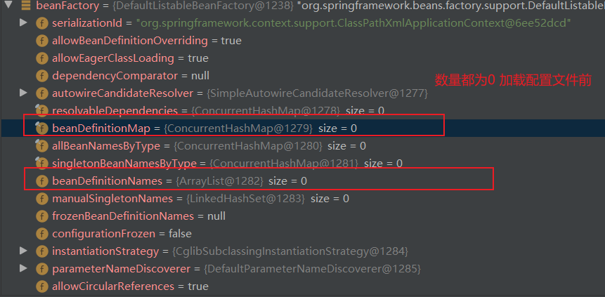
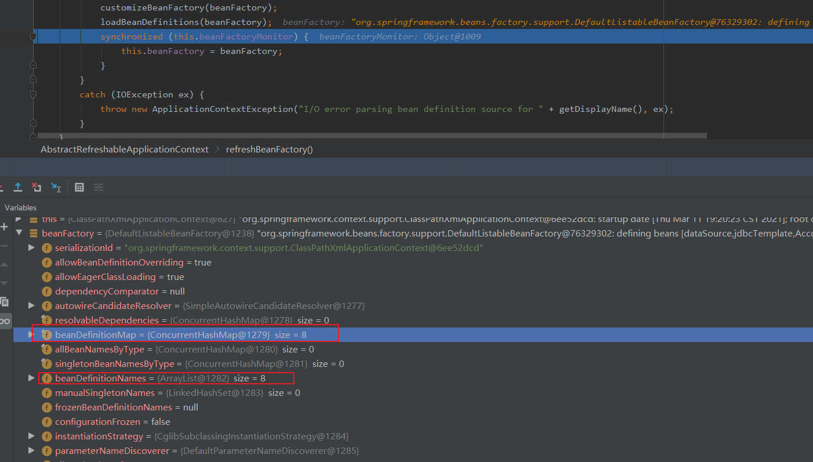
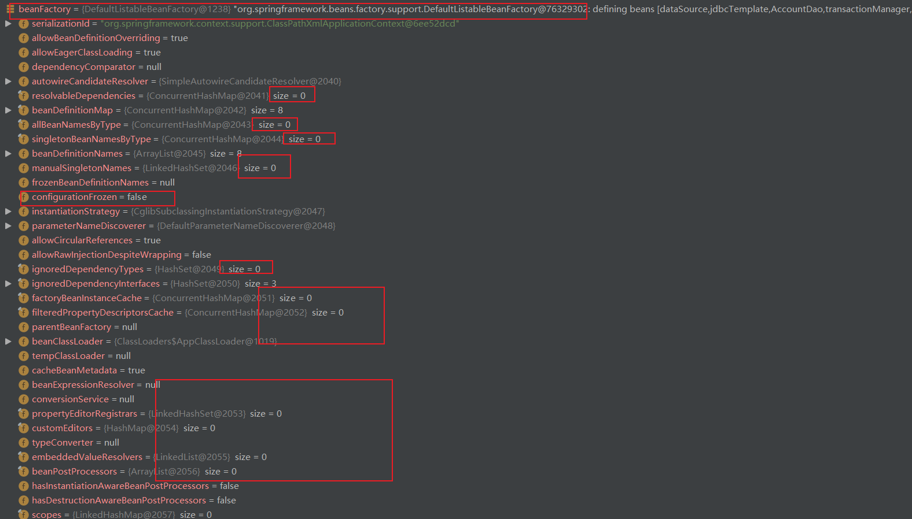

# Spring 源码开始 :baby_chick:

```java
public class mainTest {
    public static void main(String[] args) {
        AbstractApplicationContext applicationContext = new ClassPathXmlApplicationContext("test.xml"); //debug 起点
    }
}
```

## 		ClassPathXmlApplicationContext

​			构造方法

```java
public ClassPathXmlApplicationContext(String[] configLocations, boolean refresh, ApplicationContext parent)
      throws BeansException {

   super(parent); //调用父类的构造方法
   setConfigLocations(configLocations); // configLocation: "test.xml"
   if (refresh) {s
      refresh(); // refresh 方法 
   }
}
```

## refresh()		

​	进入到refresh()

```java
@Override
public void refresh() throws BeansException, IllegalStateException {
   synchronized (this.startupShutdownMonitor) {
      // Prepare this context for refreshing. 做一些准备工作
      prepareRefresh(); 

      // Tell the subclass to refresh the internal bean factory. //创建ioc 容器并且加载
      ConfigurableListableBeanFactory beanFactory = obtainFreshBeanFactory();
		
      // Prepare the bean factory for use in this context.
      // 对BeanFactory的属性进行填充 （准备工作）
      prepareBeanFactory(beanFactory);

      try {
         // Allows post-processing of the bean factory in context subclasses.
         postProcessBeanFactory(beanFactory);

         // Invoke factory processors registered as beans in the context.
         invokeBeanFactoryPostProcessors(beanFactory);

         // Register bean processors that intercept bean creation.
         registerBeanPostProcessors(beanFactory);

         // Initialize message source for this context.
         initMessageSource();

         // Initialize event multicaster for this context.
         initApplicationEventMulticaster();

         // Initialize other special beans in specific context subclasses.
         onRefresh();

         // Check for listener beans and register them.
         registerListeners();

         // Instantiate all remaining (non-lazy-init) singletons.
         finishBeanFactoryInitialization(beanFactory);

         // Last step: publish corresponding event.
         finishRefresh();
      }
```

### obtainFreshBeanFactory()

ConfigurableListableBeanFactory beanFactory = obtainFreshBeanFactory();

```java
protected ConfigurableListableBeanFactory obtainFreshBeanFactory() {
   refreshBeanFactory(); // 创建ioc容器
   ConfigurableListableBeanFactory beanFactory = getBeanFactory();
   if (logger.isDebugEnabled()) {
      logger.debug("Bean factory for " + getDisplayName() + ": " + beanFactory);
   }
   return beanFactory;
}
```

#### refreshBeanFactory()

​	

```java
@Override
protected final void refreshBeanFactory() throws BeansException {
   if (hasBeanFactory()) { 	// 判断是否有BeanFactory
      destroyBeans();		// 有则销毁
      closeBeanFactory();	// 关闭
   }
   try {
       // 接着创建DefaultLisableBeanFactory
      DefaultListableBeanFactory beanFactory = createBeanFactory(); 
       //为了序列化指定id，可以从id反序列化到beanFactory对象
      beanFactory.setSerializationId(getId());
       //定制beanFactory，设置相关属性，包括是否允许覆盖同名称的不同定义的对象以及循环依赖
      customizeBeanFactory(beanFactory);
       //
      loadBeanDefinitions(beanFactory); // 读取配置文件 往容器里添加bean
      synchronized (this.beanFactoryMonitor) {
         this.beanFactory = beanFactory;
      }
   }
   catch (IOException ex) {
      throw new ApplicationContextException("I/O error parsing bean definition source for " + getDisplayName(), ex);
   }
}
```

#### createBeanFactory()

​		创建 DefaultListableBeanFactory

```java
protected DefaultListableBeanFactory createBeanFactory() {
   return new DefaultListableBeanFactory(getInternalParentBeanFactory());
}
```

####  loadBeanDefinitions(beanFactory)

#### 	

执行过后




> 到此就完成了 beanFactory 和配置文件的加载 解析工作

prepareBeanFactory(beanFactory);

​	因为上面只是new 了一个DefaultListableBeanFactory对象而已 ，并没有初始化



总结一点 ：给beanFactory  做一些初始化操作	

```java
protected void prepareBeanFactory(ConfigurableListableBeanFactory beanFactory) {
   // Tell the internal bean factory to use the context's class loader etc.
   beanFactory.setBeanClassLoader(getClassLoader());
   beanFactory.setBeanExpressionResolver(new StandardBeanExpressionResolver(beanFactory.getBeanClassLoader()));
   beanFactory.addPropertyEditorRegistrar(new ResourceEditorRegistrar(this, getEnvironment()));

   // Configure the bean factory with context callbacks.
   beanFactory.addBeanPostProcessor(new ApplicationContextAwareProcessor(this));
   beanFactory.ignoreDependencyInterface(EnvironmentAware.class);
   beanFactory.ignoreDependencyInterface(EmbeddedValueResolverAware.class);
   beanFactory.ignoreDependencyInterface(ResourceLoaderAware.class);
   beanFactory.ignoreDependencyInterface(ApplicationEventPublisherAware.class);
   beanFactory.ignoreDependencyInterface(MessageSourceAware.class);
   beanFactory.ignoreDependencyInterface(ApplicationContextAware.class);

   // BeanFactory interface not registered as resolvable type in a plain factory.
   // MessageSource registered (and found for autowiring) as a bean.
   beanFactory.registerResolvableDependency(BeanFactory.class, beanFactory);
   beanFactory.registerResolvableDependency(ResourceLoader.class, this);
   beanFactory.registerResolvableDependency(ApplicationEventPublisher.class, this);
   beanFactory.registerResolvableDependency(ApplicationContext.class, this);

   // Register early post-processor for detecting inner beans as ApplicationListeners.
   beanFactory.addBeanPostProcessor(new ApplicationListenerDetector(this));

   // Detect a LoadTimeWeaver and prepare for weaving, if found.
   if (beanFactory.containsBean(LOAD_TIME_WEAVER_BEAN_NAME)) {
      beanFactory.addBeanPostProcessor(new LoadTimeWeaverAwareProcessor(beanFactory));
      // Set a temporary ClassLoader for type matching.
      beanFactory.setTempClassLoader(new ContextTypeMatchClassLoader(beanFactory.getBeanClassLoader()));
   }

   // Register default environment beans. 
   // 注册默认的系统bean到一级缓存
   if (!beanFactory.containsLocalBean(ENVIRONMENT_BEAN_NAME)) {
      beanFactory.registerSingleton(ENVIRONMENT_BEAN_NAME, getEnvironment());
   }
   if (!beanFactory.containsLocalBean(SYSTEM_PROPERTIES_BEAN_NAME)) {
      beanFactory.registerSingleton(SYSTEM_PROPERTIES_BEAN_NAME, getEnvironment().getSystemProperties());
   }
   if (!beanFactory.containsLocalBean(SYSTEM_ENVIRONMENT_BEAN_NAME)) {
      beanFactory.registerSingleton(SYSTEM_ENVIRONMENT_BEAN_NAME, getEnvironment().getSystemEnvironment());
   }
}
```

​	可看出 一堆se方法

### postProcessBeanFactory(beanFactory); 

​		空方法 为子类提供扩展的

invokeBeanFactoryPostProcessors(beanFactory);	

​		执行 BeanFactoryPostProcessors 

###  registerBeanPostProcessors(beanFactory);

​		注册bean处理器 准备beanPostProcessors 和监听器 

> ​		这里只是注册	 并没有执行

###  	initMessageSource();

​		为上下文初始化message 源，即不同语言的消息体，国际化处理


### initApplicationEventMulticaster();

​		初始化事件监听多路广播器

### onRefresh();

```java
protected void onRefresh() throws BeansException {
   // For subclasses: do nothing by default. 留给子类实现
}
```

### registerListeners();

​		查找所有监听器的bean 并且注册他们

> 到此为止 还是前戏   准备工作
>
> 以下开始实例化

### finishBeanFactoryInitialization(beanFactory); （※）

​		实例化剩下的单例对象（非懒加载的）

​	

```java
protected void finishBeanFactoryInitialization(ConfigurableListableBeanFactory beanFactory) {
   // Initialize conversion service for this context.
   // 为上下文初始化类型转化器
   if (beanFactory.containsBean(CONVERSION_SERVICE_BEAN_NAME) &&
         beanFactory.isTypeMatch(CONVERSION_SERVICE_BEAN_NAME, ConversionService.class)) {
      beanFactory.setConversionService(
            beanFactory.getBean(CONVERSION_SERVICE_BEAN_NAME, ConversionService.class));
   }

   // Register a default embedded value resolver if no bean post-processor
   // (such as a PropertyPlaceholderConfigurer bean) registered any before:
   // at this point, primarily for resolution in annotation attribute values.
   if (!beanFactory.hasEmbeddedValueResolver()) {
      beanFactory.addEmbeddedValueResolver(new StringValueResolver() {
         @Override
         public String resolveStringValue(String strVal) {
            return getEnvironment().resolvePlaceholders(strVal);
         }
      });
   }

   // Initialize LoadTimeWeaverAware beans early to allow for registering their transformers early.
   String[] weaverAwareNames = beanFactory.getBeanNamesForType(LoadTimeWeaverAware.class, false, false);
   for (String weaverAwareName : weaverAwareNames) {
      getBean(weaverAwareName);
   }

   // Stop using the temporary ClassLoader for type matching.
   beanFactory.setTempClassLoader(null);

   // Allow for caching all bean definition metadata, not expecting further changes.
   beanFactory.freezeConfiguration();

   // Instantiate all remaining (non-lazy-init) singletons.
   // 实例化剩下的单例对象（非懒加载的）
   beanFactory.preInstantiateSingletons();
}
```

#### 		preInstantiateSingletons（）

```java
@Override
public void preInstantiateSingletons() throws BeansException {
   if (this.logger.isDebugEnabled()) {
      this.logger.debug("Pre-instantiating singletons in " + this);
   }

   // Iterate over a copy to allow for init methods which in turn register new bean definitions.
   // While this may not be part of the regular factory bootstrap, it does otherwise work fine.
    //将所有的beanDefinition的名字创一个集合
   List<String> beanNames = new ArrayList<String>(this.beanDefinitionNames);

   // Trigger initialization of all non-lazy singleton beans...
   // 触发所有非延迟加载单例bean的初始化，遍历集合的对象
   for (String beanName : beanNames) {
      // 合并父类BeanDefinition
      RootBeanDefinition bd = getMergedLocalBeanDefinition(beanName);
      // 条件判断，抽象，单例，非懒加载
      if (!bd.isAbstract() && bd.isSingleton() && !bd.isLazyInit()) {
         // 判断是否实现了FactoryBean接口
         if (isFactoryBean(beanName)) {
            // 根据&+BeanName来获取具体对象
            final FactoryBean<?> factory = (FactoryBean<?>) getBean(FACTORY_BEAN_PREFIX + beanName);
            //判断这个FactoryBean是否希望急切地初始化
            boolean isEagerInit;
            if (System.getSecurityManager() != null && factory instanceof SmartFactoryBean) {
               isEagerInit = AccessController.doPrivileged(new PrivilegedAction<Boolean>() {
                  @Override
                  public Boolean run() {
                     return ((SmartFactoryBean<?>) factory).isEagerInit();
                  }
               }, getAccessControlContext());
            }
            else {
               isEagerInit = (factory instanceof SmartFactoryBean &&
                     ((SmartFactoryBean<?>) factory).isEagerInit());
            }
            if (isEagerInit) {
               getBean(beanName);
            }
         }
         else {
            //如果beanName对应地bean不是FactoryBean,只是普通地bean，通过beanName获取
            getBean(beanName); 
         }
      }
   }

   // Trigger post-initialization callback for all applicable beans...
   for (String beanName : beanNames) {
      Object singletonInstance = getSingleton(beanName);
      if (singletonInstance instanceof SmartInitializingSingleton) {
         final SmartInitializingSingleton smartSingleton = (SmartInitializingSingleton) singletonInstance;
         if (System.getSecurityManager() != null) {
            AccessController.doPrivileged(new PrivilegedAction<Object>() {
               @Override
               public Object run() {
                  smartSingleton.afterSingletonsInstantiated();
                  return null;
               }
            }, getAccessControlContext());
         }
         else {
            smartSingleton.afterSingletonsInstantiated();
         }
      }
   }
}
```

​		

##### getBean(beanName);  

​	>  doGetBean(name, null, null, false);

```java
public Object getBean(String name) throws BeansException {
   //此方法是实际获取bean的方法，也是触发依赖注入的方法
   return doGetBean(name, null, null, false);
}
```

```java
protected <T> T doGetBean(
      final String name, final Class<T> requiredType, final Object[] args, boolean typeCheckOnly)
      throws BeansException {

 		 //判断逻辑......

         // Create bean instance.
         if (mbd.isSingleton()) {
            sharedInstance = getSingleton(beanName, new ObjectFactory<Object>() {
               @Override
               public Object getObject() throws BeansException {
                  try {
                     return createBean(beanName, mbd, args);
                  }
                  catch (BeansException ex) {
                     // Explicitly remove instance from singleton cache: It might have been put there
                     // eagerly by the creation process, to allow for circular reference resolution.
                     // Also remove any beans that received a temporary reference to the bean.
                     destroySingleton(beanName);
                     throw ex;
                  }
               }
            });
            bean = getObjectForBeanInstance(sharedInstance, name, beanName, mbd);
         }

         else if (mbd.isPrototype()) {
            // It's a prototype -> create a new instance.
            Object prototypeInstance = null;
            try {
               beforePrototypeCreation(beanName);
               prototypeInstance = createBean(beanName, mbd, args);
            }
            finally {
               afterPrototypeCreation(beanName);
            }
            bean = getObjectForBeanInstance(prototypeInstance, name, beanName, mbd);
         }

         else {
            String scopeName = mbd.getScope();
            final Scope scope = this.scopes.get(scopeName);
            if (scope == null) {
               throw new IllegalStateException("No Scope registered for scope name '" + scopeName + "'");
            }
            try {
               Object scopedInstance = scope.get(beanName, new ObjectFactory<Object>() {
                  @Override
                  public Object getObject() throws BeansException {
                     beforePrototypeCreation(beanName);
                     try {
                        return createBean(beanName, mbd, args);
                     }
                     finally {
                        afterPrototypeCreation(beanName);
                     }
                  }
               });
               bean = getObjectForBeanInstance(scopedInstance, name, beanName, mbd);
            }
            catch (IllegalStateException ex) {
               throw new BeanCreationException(beanName,
                     "Scope '" + scopeName + "' is not active for the current thread; consider " +
                     "defining a scoped proxy for this bean if you intend to refer to it from a singleton",
                     ex);
            }
         }
      }
      catch (BeansException ex) {
         cleanupAfterBeanCreationFailure(beanName);
         throw ex;
      }
   }

   // Check if required type matches the type of the actual bean instance.
   if (requiredType != null && bean != null && !requiredType.isInstance(bean)) {
      try {
         return getTypeConverter().convertIfNecessary(bean, requiredType);
      }
      catch (TypeMismatchException ex) {
         if (logger.isDebugEnabled()) {
            logger.debug("Failed to convert bean '" + name + "' to required type '" +
                  ClassUtils.getQualifiedName(requiredType) + "'", ex);
         }
         throw new BeanNotOfRequiredTypeException(name, requiredType, bean.getClass());
      }
   }
   return (T) bean;
}
```

###### 		createBean(beanName, mbd, args);

```java
protected Object createBean(String beanName, RootBeanDefinition mbd, Object[] args) throws BeanCreationException {
   // ....

   Object beanInstance = doCreateBean(beanName, mbdToUse, args);
   if (logger.isDebugEnabled()) {
      logger.debug("Finished creating instance of bean '" + beanName + "'");
   }
   return beanInstance;
}
```

###### 			7.doCreateBean(beanName, mbdToUse, args);

​			

```java
protected Object doCreateBean(final String beanName, final RootBeanDefinition mbd, final Object[] args)
      throws BeanCreationException {

   // Instantiate the bean.
   // 初始化这个bean
   BeanWrapper instanceWrapper = null;
   if (mbd.isSingleton()) {
      instanceWrapper = this.factoryBeanInstanceCache.remove(beanName);
   }
   if (instanceWrapper == null) {
       //根据执行bean使用对应的策略创建新的实例，如，工厂方法，构造方法主动注入，简单初始化 （通过反射的方式创建对象）
      instanceWrapper = createBeanInstance(beanName, mbd, args);
   }
   final Object bean = (instanceWrapper != null ? instanceWrapper.getWrappedInstance() : null);
   Class<?> beanType = (instanceWrapper != null ? instanceWrapper.getWrappedClass() : null);
   mbd.resolvedTargetType = beanType;

	//...
}
```

###### 8.createBeanInstance(beanName, mbd, args);

​	

```java
protected BeanWrapper createBeanInstance(String beanName, RootBeanDefinition mbd, Object[] args) {
	//....判断
    //需要根据参数解析构造函数
	Constructor<?>[] ctors = determineConstructorsFromBeanPostProcessors(beanClass, beanName);
    
    //....
    
    // No special handling: simply use no-arg constructor. 使用默认构造函数构造
   return instantiateBean(beanName, mbd);
}
```

```java
protected BeanWrapper instantiateBean(final String beanName, final RootBeanDefinition mbd) {
   try {
      Object beanInstance;
      final BeanFactory parent = this;
      if (System.getSecurityManager() != null) {
         beanInstance = AccessController.doPrivileged(new PrivilegedAction<Object>() {
            @Override
            public Object run() {
               return getInstantiationStrategy().instantiate(mbd, beanName, parent);
            }
         }, getAccessControlContext());
      }
      else {
         // 获取策略 并进行实例化
         beanInstance = getInstantiationStrategy().instantiate(mbd, beanName, parent);
      }
      BeanWrapper bw = new BeanWrapperImpl(beanInstance);
      initBeanWrapper(bw);
      return bw;
   }
   catch (Throwable ex) {
      throw new BeanCreationException(
            mbd.getResourceDescription(), beanName, "Instantiation of bean failed", ex);
   }
}
```

###### 		9.getInstantiationStrategy().instantiate(mbd, beanName, parent);

```java
public Object instantiate(RootBeanDefinition bd, String beanName, BeanFactory owner) {
   // Don't override the class with CGLIB if no overrides.
   if (bd.getMethodOverrides().isEmpty()) {
      Constructor<?> constructorToUse;
      synchronized (bd.constructorArgumentLock) {
         constructorToUse = (Constructor<?>) bd.resolvedConstructorOrFactoryMethod;
         if (constructorToUse == null) {
            final Class<?> clazz = bd.getBeanClass();
            if (clazz.isInterface()) {
               throw new BeanInstantiationException(clazz, "Specified class is an interface");
            }
            try {
               if (System.getSecurityManager() != null) {
                  constructorToUse = AccessController.doPrivileged(new PrivilegedExceptionAction<Constructor<?>>() {
                     @Override
                     public Constructor<?> run() throws Exception {
                        // clazz.getDeclaredConstructor((Class[]) null);
                        return clazz.getDeclaredConstructor((Class[]) null);
                     }
                  });
               }
               else {
                  constructorToUse = clazz.getDeclaredConstructor((Class[]) null);
               }
               bd.resolvedConstructorOrFactoryMethod = constructorToUse;
            }
            catch (Throwable ex) {
               throw new BeanInstantiationException(clazz, "No default constructor found", ex);
            }
         }
      }
      // 实例化
      return BeanUtils.instantiateClass(constructorToUse);
   }
   else {
      // Must generate CGLIB subclass.
      return instantiateWithMethodInjection(bd, beanName, owner);
   }
}
```

###### 10.BeanUtils.instantiateClass(constructorToUse);

```java
public static <T> T instantiateClass(Constructor<T> ctor, Object... args) throws BeanInstantiationException {
   Assert.notNull(ctor, "Constructor must not be null");
   try {
      ReflectionUtils.makeAccessible(ctor);
      //newInstance
      return ctor.newInstance(args);
   }
  //.....
}
```

> 至此  完成了实例化 返回到 docreateBean(beanName, mbd, args);

###### 		7.doCreateBean(beanName, mbdToUse, args);

```java
protected Object doCreateBean(final String beanName, final RootBeanDefinition mbd, final Object[] args)
      throws BeanCreationException {

   // Instantiate the bean.
   BeanWrapper instanceWrapper = null;
   if (mbd.isSingleton()) {
      instanceWrapper = this.factoryBeanInstanceCache.remove(beanName);
   }
   if (instanceWrapper == null) {
      instanceWrapper = createBeanInstance(beanName, mbd, args);
   }
   final Object bean = (instanceWrapper != null ? instanceWrapper.getWrappedInstance() : null);
   Class<?> beanType = (instanceWrapper != null ? instanceWrapper.getWrappedClass() : null);
   mbd.resolvedTargetType = beanType;

   //......

   // Initialize the bean instance.
   Object exposedObject = bean;
   try {
      //填充属性 
      populateBean(beanName, mbd, instanceWrapper);
      if (exposedObject != null) {
         //执行实现aware接口方法
         exposedObject = initializeBean(beanName, exposedObject, mbd);
      }
   }
   catch (Throwable ex) {
      if (ex instanceof BeanCreationException && beanName.equals(((BeanCreationException) ex).getBeanName())) {
         throw (BeanCreationException) ex;
      }
      else {
         throw new BeanCreationException(
               mbd.getResourceDescription(), beanName, "Initialization of bean failed", ex);
      }
   }

   if (earlySingletonExposure) {
      Object earlySingletonReference = getSingleton(beanName, false);
      if (earlySingletonReference != null) {
         if (exposedObject == bean) {
            exposedObject = earlySingletonReference;
         }
         else if (!this.allowRawInjectionDespiteWrapping && hasDependentBean(beanName)) {
            String[] dependentBeans = getDependentBeans(beanName);
            Set<String> actualDependentBeans = new LinkedHashSet<String>(dependentBeans.length);
            for (String dependentBean : dependentBeans) {
               if (!removeSingletonIfCreatedForTypeCheckOnly(dependentBean)) {
                  actualDependentBeans.add(dependentBean);
               }
            }
            if (!actualDependentBeans.isEmpty()) {
               throw new BeanCurrentlyInCreationException(beanName,
                     "Bean with name '" + beanName + "' has been injected into other beans [" +
                     StringUtils.collectionToCommaDelimitedString(actualDependentBeans) +
                     "] in its raw version as part of a circular reference, but has eventually been " +
                     "wrapped. This means that said other beans do not use the final version of the " +
                     "bean. This is often the result of over-eager type matching - consider using " +
                     "'getBeanNamesOfType' with the 'allowEagerInit' flag turned off, for example.");
            }
         }
      }
   }

   // Register bean as disposable.
   try {
      registerDisposableBeanIfNecessary(beanName, bean, mbd);
   }
   catch (BeanDefinitionValidationException ex) {
      throw new BeanCreationException(
            mbd.getResourceDescription(), beanName, "Invalid destruction signature", ex);
   }

   return exposedObject;
}
```

###### 		 8.initializeBean(beanName, exposedObject, mbd);

```java
protected Object initializeBean(final String beanName, final Object bean, RootBeanDefinition mbd) {
   if (System.getSecurityManager() != null) {
      AccessController.doPrivileged(new PrivilegedAction<Object>() {
         @Override
         public Object run() {
            invokeAwareMethods(beanName, bean);
            return null;
         }
      }, getAccessControlContext());
   }
   else {
      //对特殊的bean处理Aware接口
      invokeAwareMethods(beanName, bean);
   }

   Object wrappedBean = bean;
   if (mbd == null || !mbd.isSynthetic()) {
      //在PostProcessorsBefore 方法里设置了 默认忽略的但是的用户实现的接口
      wrappedBean = applyBeanPostProcessorsBeforeInitialization(wrappedBean, beanName);
   }

   try {
       //调用自定义的init方法
      invokeInitMethods(beanName, wrappedBean, mbd);
   }
   catch (Throwable ex) {
      throw new BeanCreationException(
            (mbd != null ? mbd.getResourceDescription() : null),
            beanName, "Invocation of init method failed", ex);
   }

   if (mbd == null || !mbd.isSynthetic()) {
      wrappedBean = applyBeanPostProcessorsAfterInitialization(wrappedBean, beanName);
   }
   return wrappedBean;
}
```

​			因为某些方法是默认不设置的 例如EnvironmentAware 

```java
@Data
@AllArgsConstructor
@NoArgsConstructor
public class User implements BeanNameAware, "EnvironmentAware" {

    private Integer id;

    private String userName;

    private String beanName;

    private Environment environment;

    @Override
    public void setBeanName(String name) {
        this.beanName = name;
    }

    @Override
    public void setEnvironment(Environment environment) {
        this.environment = environment;
    }
}
```

###### 		2.0.0refresh

```java
protected void prepareBeanFactory(ConfigurableListableBeanFactory beanFactory) {
   // Tell the internal bean factory to use the context's class loader etc.
   beanFactory.setBeanClassLoader(getClassLoader());
   beanFactory.setBeanExpressionResolver(new StandardBeanExpressionResolver(beanFactory.getBeanClassLoader()));
   beanFactory.addPropertyEditorRegistrar(new ResourceEditorRegistrar(this, getEnvironment()));

   // Configure the bean factory with context callbacks.
   beanFactory.addBeanPostProcessor(new ApplicationContextAwareProcessor(this));
   //设置要忽略自动装配的接口，这些接口的实现是由容器通过set方法 设置的 
   //所以在使用autowire进行注入的时候需要将这些方法忽略。
   beanFactory.ignoreDependencyInterface(EnvironmentAware.class);
   beanFactory.ignoreDependencyInterface(EmbeddedValueResolverAware.class);
   beanFactory.ignoreDependencyInterface(ResourceLoaderAware.class);
   beanFactory.ignoreDependencyInterface(ApplicationEventPublisherAware.class);
   beanFactory.ignoreDependencyInterface(MessageSourceAware.class);
   beanFactory.ignoreDependencyInterface(ApplicationContextAware.class);
```

```java
    private void invokeAwareInterfaces(Object bean) {
      if (bean instanceof EnvironmentAware) {
          //set方法
         ((EnvironmentAware) bean).setEnvironment(this.applicationContext.getEnvironment());
      }
      if (bean instanceof EmbeddedValueResolverAware) {
         ((EmbeddedValueResolverAware) bean).setEmbeddedValueResolver(this.embeddedValueResolver);
      }
      if (bean instanceof ResourceLoaderAware) {
         ((ResourceLoaderAware) bean).setResourceLoader(this.applicationContext);
      }
      if (bean instanceof ApplicationEventPublisherAware) {
         ((ApplicationEventPublisherAware) bean).setApplicationEventPublisher(this.applicationContext);
      }
      if (bean instanceof MessageSourceAware) {
         ((MessageSourceAware) bean).setMessageSource(this.applicationContext);
      }
      if (bean instanceof ApplicationContextAware) {
         ((ApplicationContextAware) bean).setApplicationContext(this.applicationContext);
      }
   }

}
```

###### 	9.invokeInitMethods(beanName, wrappedBean, mbd);

​		

```java
protected Object initializeBean(String beanName, Object bean, @Nullable RootBeanDefinition mbd) {
   if (System.getSecurityManager() != null) {
      AccessController.doPrivileged((PrivilegedAction<Object>) () -> {
         invokeAwareMethods(beanName, bean);
         return null;
      }, getAccessControlContext());
   }
   else {
      invokeAwareMethods(beanName, bean);
   }

   Object wrappedBean = bean;
   if (mbd == null || !mbd.isSynthetic()) {
      wrappedBean = applyBeanPostProcessorsBeforeInitialization(wrappedBean, beanName);
   }

   try {
       // 执行 init - method方法
      invokeInitMethods(beanName, wrappedBean, mbd);
   }
   catch (Throwable ex) {
      throw new BeanCreationException(
            (mbd != null ? mbd.getResourceDescription() : null),
            beanName, "Invocation of init method failed", ex);
   }
   if (mbd == null || !mbd.isSynthetic()) {
      wrappedBean = applyBeanPostProcessorsAfterInitialization(wrappedBean, beanName);
   }

   return wrappedBean;
}
```

> ​		至此 bean的实例化 初始化就结束了

​		

## DefaultSingletonBeanRegistry (※)

```java
public class DefaultSingletonBeanRegistry extends SimpleAliasRegistry implements SingletonBeanRegistry {

   /** Maximum number of suppressed exceptions to preserve. */
   private static final int SUPPRESSED_EXCEPTIONS_LIMIT = 100;


   /** Cache of singleton objects: bean name to bean instance. */
   //一级缓存
   //用于保存BeanName和创建bean实例之间的关系
   private final Map<String, Object> singletonObjects = new ConcurrentHashMap<>(256);

   /** Cache of singleton factories: bean name to ObjectFactory. */
   //三级缓存
   //用于保存BeanName和创建工厂之间的关系
   private final Map<String, ObjectFactory<?>> singletonFactories = new HashMap<>(16);

   /** Cache of early singleton objects: bean name to bean instance. */
   //二级缓存
   //保存BeanName和创建bean之间的关系 不同于一级缓存的是，当一个单例bean被放到这里后，那么当bean还在就可以通过getBean方法获得，可以方便进行循环依赖的检测
   private final Map<String, Object> earlySingletonObjects = new ConcurrentHashMap<>(16);

   /** Set of registered singletons, containing the bean names in registration order. */
   private final Set<String> registeredSingletons = new LinkedHashSet<>(256);

   /** Names of beans that are currently in creation. */
   private final Set<String> singletonsCurrentlyInCreation =
         Collections.newSetFromMap(new ConcurrentHashMap<>(16));

   /** Names of beans currently excluded from in creation checks. */
   private final Set<String> inCreationCheckExclusions =
         Collections.newSetFromMap(new ConcurrentHashMap<>(16));
```